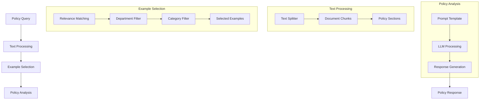

# HR Policy Analyzer (101) with LangChain: Complete Guide

## Introduction

This implementation demonstrates an HR policy analysis system by combining three key LangChain v3 concepts:
1. Prompt Templates: Dynamic policy interpretation
2. Text Splitters: Process policy documents
3. Example Selection: Smart policy precedent selection

The system provides intelligent policy analysis and guidance for HR departments in banking.

### Real-World Application Value
- Policy interpretation
- Compliance guidance
- Employee inquiries
- Decision support
- Process automation

### System Architecture Overview


## Core LangChain Concepts

### 1. Prompt Templates
```python
example_prompt = PromptTemplate(
    input_variables=["query", "department", "context", "response"],
    template="""
    Question: {query}
    Department: {department}
    Context: {context}
    Response: {response}
    """
)

self.prompt = FewShotPromptTemplate(
    examples=self.examples,
    example_prompt=example_prompt,
    prefix="You are an HR policy expert...",
    suffix="Question: {question}\nDepartment: {department}...",
    input_variables=["question", "department", "category"]
)
```

Benefits:
- Dynamic formatting
- Context inclusion
- Consistent structure
- Flexible adaptation

### 2. Text Splitters
```python
self.text_splitter = RecursiveCharacterTextSplitter(
    chunk_size=1000,
    chunk_overlap=200,
    separators=["\n\n", "\n", ". ", " "]
)
```

Features:
- Smart chunking
- Context preservation
- Efficient processing
- Hierarchical splitting

### 3. Example Selection
```python
def select_relevant_examples(self, query: PolicyQuery) -> List[Dict]:
    relevant = []
    for example in self.examples:
        if (example["department"].lower() == query.department.lower() or
            query.category.lower() in example["context"].lower()):
            relevant.append(example)
    return relevant if relevant else self.examples[:2]
```

Capabilities:
- Department matching
- Category filtering
- Relevance scoring
- Fallback selection

## Implementation Components

### 1. Policy Models
```python
class PolicyQuery(BaseModel):
    query_id: str = Field(description="Query identifier")
    department: str = Field(description="Department name")
    category: str = Field(description="Policy category")
    question: str = Field(description="Policy question")

class PolicyResponse(BaseModel):
    query_id: str = Field(description="Query identifier")
    relevant_policies: List[str] = Field(description="Relevant policy sections")
    interpretation: str = Field(description="Policy interpretation")
    precedents: List[str] = Field(description="Similar past cases")
```

Key elements:
- Query structure
- Response format
- Policy tracking
- Precedent management

### 2. Analysis Process
```python
async def analyze_policy_query(self, query: PolicyQuery) -> PolicyResponse:
    formatted_prompt = self.prompt.format(
        question=query.question,
        department=query.department,
        category=query.category
    )
    response = await self.llm.ainvoke(formatted_prompt)
    relevant_examples = self.select_relevant_examples(query)
    # Process and return response
```

Features:
- Query processing
- Context building
- Example selection
- Response generation

### 3. Example Cases
```python
self.examples = [
    {
        "query": "Can remote work arrangements be permanent?",
        "department": "Technology",
        "context": "Post-pandemic workplace flexibility",
        "response": "According to Policy Section 3.2..."
    },
    # More examples...
]
```

Capabilities:
- Department coverage
- Context variety
- Policy representation
- Response patterns

## Expected Output

### 1. Policy Query Analysis
```text
Processing Query: hr_001
Department: Risk Management
Category: Compliance Training
Question: What are the mandatory training requirements for new hires?

Analysis Results:
Relevant Policies: Section 3.2: Remote Work Policy, Section 4.1: Performance Requirements
Interpretation: New hires in risk management must complete...
```

### 2. Precedent-Based Response
```text
Relevant Precedents:
- Per Policy Section 5.1, international transfers require...
- Policy Section 7.3 states part-time staff bonuses...
```

## Best Practices

### 1. Query Processing
- Clear structure
- Context inclusion
- Department specifics
- Policy relevance

### 2. Example Selection
- Department matching
- Category relevance
- Context similarity
- Fallback options

### 3. Response Generation
- Policy references
- Clear interpretation
- Precedent inclusion
- Action guidance

## References

### 1. LangChain Core Concepts
- [Prompt Templates](https://python.langchain.com/docs/modules/model_io/prompts)
- [Text Splitters](https://python.langchain.com/docs/modules/data_connection/document_transformers)
- [Few Shot Examples](https://python.langchain.com/docs/modules/model_io/prompts/few_shot_examples)

### 2. Implementation Guides
- [HR Systems](https://python.langchain.com/docs/use_cases/hr_analytics)
- [Document Processing](https://python.langchain.com/docs/modules/data_connection)
- [Policy Analysis](https://python.langchain.com/docs/use_cases/qa_policy)

### 3. Additional Resources
- [Banking HR](https://python.langchain.com/docs/use_cases/financial)
- [Compliance](https://python.langchain.com/docs/use_cases/compliance)
- [Documentation](https://python.langchain.com/docs/use_cases/documentation)