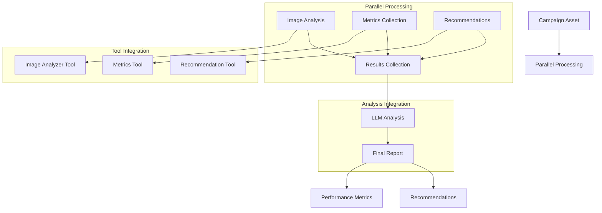

# Marketing Campaign Analyzer (102) with LangChain: Complete Guide

## Introduction

This implementation demonstrates a marketing campaign analysis system by combining three key LangChain v3 concepts:
1. Multimodality: Analyze text and image content
2. Parallel Processing: Efficient tool execution
3. Tool Calling: Integration with marketing tools

The system provides comprehensive campaign analysis for marketing departments in banking.

### Real-World Application Value
- Campaign optimization
- Performance tracking
- Content analysis
- Real-time insights
- Tool integration

### System Architecture Overview


## Core LangChain Concepts

### 1. Multimodality
```python
async def _analyze_image(self, image_path: str) -> Dict:
    return {
        "branding_score": 0.85,
        "visual_appeal": 0.78,
        "message_clarity": 0.92
    }

class CampaignAsset(BaseModel):
    asset_type: str = Field(description="Type of asset (image/text)")
    content: str = Field(description="Text content or image path")
```

Benefits:
- Mixed content analysis
- Visual assessment
- Text processing
- Comprehensive evaluation

### 2. Parallel Processing
```python
image_analysis, metrics, recommendations = await asyncio.gather(
    self._analyze_image(asset.content) if asset.asset_type == "image" else asyncio.sleep(0, {}),
    self._get_metrics(asset.asset_id),
    self._generate_recommendations({})
)
```

Features:
- Concurrent execution
- Efficient processing
- Resource optimization
- Fast results

### 3. Tool Calling
```python
self.tools = [
    Tool(
        name="analyze_image",
        description="Analyze image content and branding",
        func=self._analyze_image
    ),
    Tool(
        name="get_metrics",
        description="Get campaign performance metrics",
        func=self._get_metrics
    ),
    Tool(
        name="generate_recommendations",
        description="Generate campaign improvement recommendations",
        func=self._generate_recommendations
    )
]
```

Capabilities:
- Tool integration
- Function calling
- Service coordination
- Extensible analysis

## Implementation Components

### 1. Asset Models
```python
class CampaignAsset(BaseModel):
    asset_id: str = Field(description="Asset identifier")
    asset_type: str = Field(description="Type of asset (image/text)")
    content: str = Field(description="Text content or image path")
    metadata: Dict = Field(description="Asset metadata")

class CampaignMetrics(BaseModel):
    impressions: int = Field(description="Number of impressions")
    clicks: int = Field(description="Number of clicks")
    conversions: int = Field(description="Number of conversions")
    engagement_rate: float = Field(description="Engagement rate")
```

Key elements:
- Asset tracking
- Performance metrics
- Content management
- Metadata handling

### 2. Analysis Process
```python
async def analyze_campaign(self, asset: CampaignAsset) -> Dict[str, str]:
    # Execute tools in parallel
    image_analysis, metrics, recommendations = await asyncio.gather(...)
    
    # Generate analysis using LLM
    messages = [
        SystemMessage(content="You are a marketing campaign analyzer..."),
        HumanMessage(content=f"Analyze this campaign asset: ...")
    ]
    
    response = await self.llm.ainvoke(messages)
    return {...}
```

Features:
- Parallel execution
- LLM integration
- Result aggregation
- Error handling

## Expected Output

### 1. Campaign Analysis
```text
Analyzing Asset: camp_001
Type: image
Campaign: Premium Credit Card Launch

Analysis Results:
- Brand alignment score: 0.85
- Visual appeal rating: 0.78
- Message clarity: 0.92
```

### 2. Performance Metrics
```text
Metrics:
- Impressions: 10,000
- Clicks: 450
- Conversions: 50
- Engagement Rate: 4.5%

Recommendations:
1. Enhance brand visibility
2. Optimize call-to-action
3. Test messaging variants
```

## Best Practices

### 1. Parallel Processing
- Resource management
- Error handling
- Task coordination
- Result aggregation

### 2. Tool Integration
- Clear interfaces
- Error recovery
- Result validation
- Async support

### 3. Content Analysis
- Type validation
- Format handling
- Quality checks
- Performance tracking

## References

### 1. LangChain Core Concepts
- [Multimodality](https://python.langchain.com/docs/modules/model_io/models/image)
- [Tool Calling](https://python.langchain.com/docs/modules/agents/tools)
- [Async Processing](https://python.langchain.com/docs/expression_language/cookbook/async_parallel)

### 2. Implementation Guides
- [Marketing Analysis](https://python.langchain.com/docs/use_cases/marketing)
- [Content Analysis](https://python.langchain.com/docs/modules/data_connection)
- [Tool Integration](https://python.langchain.com/docs/modules/agents/tools/custom_tools)

### 3. Additional Resources
- [Campaign Analytics](https://python.langchain.com/docs/use_cases/analytics)
- [Asset Management](https://python.langchain.com/docs/modules/data_connection/document_management)
- [Performance Optimization](https://python.langchain.com/docs/guides/tips_for_async)