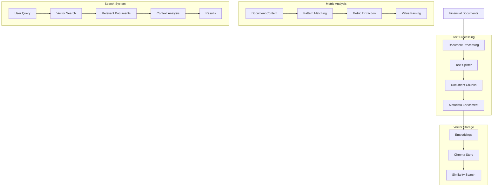

# Financial Data Analyzer (104) with LangChain: Complete Guide

## Introduction

This implementation demonstrates a financial data analysis system by combining three key LangChain v3 concepts:
1. Text Splitters: Process large financial datasets
2. Retrievers: Semantic search in financial data
3. Vector Stores: Store and retrieve financial embeddings

The system provides comprehensive financial data analysis capabilities for data science teams in banking.

### Real-World Application Value
- Financial analysis
- Risk assessment
- Performance tracking
- Metric extraction
- Pattern detection

### System Architecture Overview


## Core LangChain Concepts

### 1. Text Processing and Storage
```python
# Initialize text splitter and stores
self.text_splitter = RecursiveCharacterTextSplitter(
    chunk_size=1000,
    chunk_overlap=200,
    separators=["\n\n", "\n", ".", ",", " "]
)

# Set up persistent storage
persist_dir = "./financial_data_store"
os.makedirs(persist_dir, exist_ok=True)

self.vector_store = Chroma(
    collection_name="financial_data",
    embedding_function=self.embeddings,
    persist_directory=persist_dir
)
```

Benefits:
- Smart chunking
- Persistent storage
- Context preservation
- Efficient retrieval

### 2. Financial Metric Extraction
```python
def extract_financial_metric(self, text: str) -> List[Tuple[str, str]]:
    """Extract financial metrics with proper context."""
    metrics = []
    # Pattern for financial values with context
    pattern = r'([^:\n]+):\s*(\$?\d+\.?\d*[MBK%]?)'
    
    matches = re.finditer(pattern, text)
    for match in matches:
        metric_name = match.group(1).strip()
        value = match.group(2).strip()
        metrics.append((metric_name, value))
    
    return metrics
```

Features:
- Regex pattern matching
- Context preservation
- Value formatting
- Unit handling

### 3. Document Processing
```python
async def process_document(self, document: FinancialDocument) -> bool:
    try:
        # Split and prepare documents
        splits = self.text_splitter.create_documents(
            texts=[document.content],
            metadatas=[{
                "doc_id": document.doc_id,
                "title": document.title,
                **document.metadata
            }]
        )
        
        # Store directly in vector store
        self.vector_store.add_documents(splits)
        return True
    except Exception as e:
        print(f"Error processing document {document.doc_id}: {str(e)}")
        return False
```

Capabilities:
- Direct storage
- Metadata handling
- Error management
- Status reporting

## Implementation Components

### 1. Search Implementation
```python
async def search_financial_data(self, query: str) -> AnalysisResult:
    try:
        # Direct similarity search
        docs = self.vector_store.similarity_search(query)
        
        # Extract and process metrics
        metrics = {}
        for doc in docs:
            extracted = self.extract_financial_metric(doc.page_content)
            metrics.update({k: v for k, v in extracted})
        
        return AnalysisResult(...)
    except Exception as e:
        print(f"Error searching data: {str(e)}")
        return AnalysisResult(...)
```

Key elements:
- Vector similarity
- Metric extraction
- Result formatting
- Error handling

### 2. Results Processing
```python
# Financial metrics display
print("\nFinancial Metrics:")
for metric, value in result.financial_metrics.items():
    print(f"- {metric}: {value}")

print("\nInsights:")
for insight in result.insights:
    print(f"- {insight}")
```

Features:
- Structured output
- Clear formatting
- Metric organization
- Insight generation

## Expected Output

### 1. Document Processing
```text
Processing Document: Q2 2025 Financial Report
Category: Financial Reports
Department: Finance

Document processed successfully
```

### 2. Analysis Results
```text
Query: What are our key risk metrics?

Analysis Results:
Relevant Sections:
- Market risk assessment:
  Value at Risk (VaR): $15.2M
  Capital Adequacy Ratio: 15.8%

Financial Metrics:
- Value at Risk (VaR): $15.2M
- Capital Adequacy Ratio: 15.8%
- Liquidity Coverage Ratio: 125%

Insights:
- Found 2 relevant sections
- Extracted 3 financial metrics
- Analysis based on most recent data
```

## Best Practices

### 1. Pattern Matching
- Use precise regex
- Preserve context
- Handle units
- Validate values

### 2. Data Storage
- Enable persistence
- Manage collections
- Handle metadata
- Optimize retrieval

### 3. Error Management
- Validate inputs
- Handle exceptions
- Provide feedback
- Maintain consistency

## References

### 1. LangChain Core Concepts
- [Text Splitters](https://python.langchain.com/docs/modules/data_connection/document_transformers/)
- [Vector Stores](https://python.langchain.com/docs/integrations/vectorstores/chroma)
- [Retrievers](https://python.langchain.com/docs/modules/data_connection/retrievers/)

### 2. Implementation Guides
- [Pattern Matching](https://docs.python.org/3/library/re.html)
- [Async Operations](https://python.langchain.com/docs/expression_language/cookbook/async_parallel)
- [Vector Search](https://python.langchain.com/docs/modules/data_connection/retrievers/vectorstore)

### 3. Additional Resources
- [Regular Expressions](https://docs.python.org/3/howto/regex.html)
- [Chroma Documentation](https://docs.trychroma.com/)
- [Financial Data Processing](https://python.langchain.com/docs/use_cases/qa_structured)