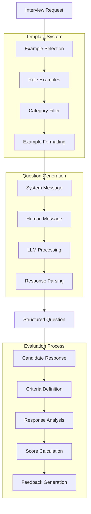

# HR Interview Assistant (105) with LangChain: Complete Guide

## Introduction

This implementation demonstrates an HR interview assistance system by combining three key LangChain v3 concepts:
1. Evaluation: Assess candidate responses
2. Prompt Templates: Generate structured interview questions
3. Example Selectors: Choose relevant interview scenarios

The system provides comprehensive interview support for HR teams in banking.

### Real-World Application Value
- Candidate assessment
- Interview standardization
- Response evaluation 
- Performance tracking
- Feedback generation

### System Architecture Overview


## Core LangChain Concepts

### 1. Example Management
```python
# Define example format
self.example_template = """
Role: {role}
Category: {category}
Question: {question}
Key Points: {points}
"""

# Banking-specific examples
self.examples = [
    {
        "role": "Risk Analyst",
        "category": "technical",
        "question": "How would you evaluate VaR models?",
        "points": "Model validation, Backtesting, Stress scenarios"
    },
    {
        "role": "Digital Banking Manager",
        "category": "behavioral",
        "question": "How do you manage digital transformation?",
        "points": "Change management, Stakeholder engagement"
    }
]
```

Benefits:
- Clear structure
- Role specificity
- Category organization
- Key point mapping

### 2. Template System
```python
# Create base template
self.question_template = PromptTemplate(
    template="""You are an expert HR interviewer for a bank. Based on these examples:

{examples}

Generate an appropriate interview question for:
Role: {role}
Category: {category}

Format your response as:
Question: [Your question here]
Key Points: [Key points to look for]""",
    input_variables=["examples", "role", "category"]
)

# Generate with context
result = await self.llm.ainvoke([
    SystemMessage(content="You are an expert HR interviewer..."),
    HumanMessage(content=self.question_template.format(...))
])
```

Features:
- Contextual prompting
- Structured output
- Role adaptation
- Clear formatting

### 3. Response Evaluation
```python
async def evaluate_response(self, question: InterviewQuestion, 
                          response: CandidateResponse) -> EvaluationResult:
    criteria = {
        "completeness": f"Response addresses the key points: {points}",
        "technical_accuracy": "Demonstrates banking knowledge",
        "clarity": "Clear communication"
    }
    
    eval_results = await self.evaluator.aevaluate_strings(
        prediction=response.response,
        input=question.question,
        criteria=criteria
    )
```

Capabilities:
- Dynamic criteria
- Point-based evaluation
- Structured feedback
- Score calculation

## Implementation Components

### 1. Question Generation
```python
async def generate_question(self, role: str, category: str) -> InterviewQuestion:
    # Format category-specific examples
    formatted_examples = "\n\n".join([
        self.example_prompt.format(**example)
        for example in self.examples
        if example["category"] == category
    ])
    
    # Generate and parse response
    result = await self.llm.ainvoke([...])
    question_parts = result.content.split("Key Points:")
    
    return InterviewQuestion(
        role=role,
        category=category,
        question=question,
        expected_points=points
    )
```

Key elements:
- Category filtering
- Example formatting
- Response parsing
- Structured output

### 2. Evaluation Process
```python
evaluation = await assistant.evaluate_response(question, response)
if evaluation:
    print(f"Score: {evaluation.score:.1f}/10")
    print("\nStrengths:")
    for key, value in evaluation.strengths.items():
        print(f"- {key}: {value}")
    print("\nAreas for Improvement:")
    for area in evaluation.areas_for_improvement:
        print(f"- {area}")
```

Features:
- Comprehensive scoring
- Detailed feedback
- Strength analysis
- Improvement suggestions

## Expected Output

### 1. Generated Questions
```text
Generating question for Credit Risk Manager
Category: technical

Generated Question:
- How would you develop and validate a credit scoring model?

Expected Points:
- Model development methodology
- Risk factor analysis
- Validation procedures
```

### 2. Evaluation Results
```text
Evaluation Results:
Score: 8.5/10

Strengths:
- Completeness: Covers key methodologies
- Technical accuracy: Strong understanding
- Communication: Well-structured

Areas for Improvement:
- Include regulatory considerations
- Expand on validation methods
```

## Best Practices

### 1. Example Design
- Role-specific scenarios
- Clear categorization
- Key point definition
- Banking context

### 2. Template Structure
- Clear instructions
- Consistent format
- Example integration
- Output structure

### 3. Evaluation Process
- Relevant criteria
- Point-based scoring
- Constructive feedback
- Clear metrics

## References

### 1. LangChain Core Concepts
- [Prompt Templates](https://python.langchain.com/docs/modules/model_io/prompts/prompt_templates)
- [Chat Messages](https://python.langchain.com/docs/modules/model_io/messages)
- [Evaluators](https://python.langchain.com/docs/guides/evaluation/)

### 2. Implementation Guides
- [Template Creation](https://python.langchain.com/docs/modules/model_io/prompts/prompt_templates)
- [Response Evaluation](https://python.langchain.com/docs/guides/evaluation/string)
- [Chat Models](https://python.langchain.com/docs/integrations/chat/azure_chat_openai)

### 3. Additional Resources
- [Banking Interview Guides](https://python.langchain.com/docs/use_cases/qa_structured)
- [Example Management](https://python.langchain.com/docs/modules/model_io/prompts/prompt_templates)
- [Evaluation Metrics](https://python.langchain.com/docs/guides/evaluation/string/criteria)