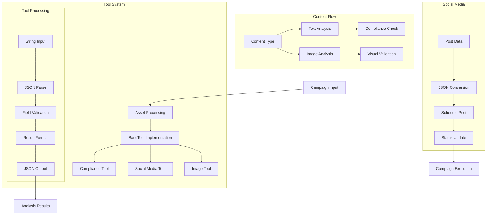

# Marketing Campaign Assistant (106) with LangChain: Complete Guide

## Introduction

This implementation demonstrates a marketing campaign assistant by combining three key LangChain v3 concepts:
1. Multimodality: Handle text and image content
2. Streaming: Real-time campaign updates
3. Tool Calling: Marketing automation integration

The system provides comprehensive campaign management support for marketing teams in banking.

### Real-World Application Value
- Campaign optimization
- Regulatory compliance
- Content analysis
- Automation integration
- Real-time feedback

### System Architecture Overview


## Core LangChain Concepts

### 1. Tool Implementation
```python
class SocialMediaTool(BaseTool):
    """Tool for social media scheduling."""
    name: str = Field(default="social_scheduler")
    description: str = Field(default="Schedules social media posts.")
    
    def _run(self, input: str) -> str:
        """Schedule a social media post."""
        try:
            # Parse input as JSON
            post_data = json.loads(input)
            
            # Validate required fields
            if not all(k in post_data for k in ["platform", "datetime"]):
                raise ValueError("Missing required fields")
            
            result = {
                "status": "scheduled",
                "platform": post_data["platform"],
                "datetime": post_data["datetime"],
                "content": post_data.get("content")
            }
            return json.dumps(result)
        except Exception as e:
            return json.dumps({"status": "error", "error": str(e)})
```

Features:
- String input handling
- JSON parsing
- Field validation
- Error management

### 2. Tool Invocation
```python
# Create post data
post_data = {
    "platform": timing["platform"],
    "datetime": timing["datetime"],
    "content": content
}

# Schedule post with JSON string input
schedule_result = await self.social_media_tool.ainvoke(
    input=json.dumps(post_data)
)
schedule_results.append(json.loads(schedule_result))
```

Benefits:
- Clean data passing
- Safe serialization
- Result validation
- Error handling

### 3. Content Processing
```python
# Process each asset
for asset in assets:
    if asset.asset_type == "text":
        compliance_result = await self.compliance_tool.ainvoke(
            input=asset.content
        )
    elif asset.asset_type == "image":
        image_result = await self.image_tool.ainvoke(
            input=base64.b64encode(asset.content).decode()
        )
```

Capabilities:
- Type-based routing
- Content validation
- Async processing
- Result aggregation

## Implementation Components

### 1. Asset Management
```python
class CampaignAsset(BaseModel):
    """Schema for marketing campaign assets."""
    asset_id: str = Field(description="Asset identifier")
    asset_type: str = Field(description="Type (image/text/video)")
    content: Union[str, bytes] = Field(description="Asset content")
    metadata: Dict = Field(description="Asset metadata")
```

Key elements:
- Type validation
- Content flexibility
- Metadata support
- Clear structure

### 2. Campaign Analysis
```python
return CampaignAnalysis(
    recommendations=recommendations,
    risk_factors=[
        warning for result in analysis_results 
        if "compliance" in result 
        for warning in result["compliance"].get("warnings", [])
    ],
    compliance_check={
        "status": "reviewed",
        "timestamp": datetime.now().isoformat(),
        "schedule_status": schedule_results
    }
)
```

Features:
- Comprehensive results
- Risk tracking
- Status monitoring
- Schedule tracking

## Expected Output

### 1. Campaign Analysis
```text
Campaign Analysis:
- Content optimization recommendations
- Timing suggestions
- Risk mitigation strategies
- Compliance improvements

Risk Factors:
- Missing required terms
- Content warnings
```

### 2. Schedule Status
```text
Schedule Status:
- Platform: linkedin
  Time: 2025-04-01T09:00:00
  Status: scheduled
- Platform: instagram
  Time: 2025-04-02T12:00:00
  Status: scheduled
```

## Best Practices

### 1. Input Handling
- Use string inputs
- Parse JSON safely
- Validate fields
- Handle errors

### 2. Tool Design
- Clear interfaces
- Proper validation
- Error handling
- Result formatting

### 3. Content Management
- Type validation
- Content matching
- Safe processing
- Result tracking

## References

### 1. LangChain Core Concepts
- [BaseTool](https://python.langchain.com/docs/modules/agents/tools/custom_tools)
- [Tool Input](https://python.langchain.com/docs/modules/agents/tools/how_to/tool_input_validation)
- [Async Tools](https://python.langchain.com/docs/modules/agents/tools/custom_tools#async-tools)

### 2. Implementation Guides
- [JSON Handling](https://docs.python.org/3/library/json.html)
- [Error Handling](https://docs.python.org/3/tutorial/errors.html)
- [Async Operations](https://docs.python.org/3/library/asyncio.html)

### 3. Additional Resources
- [Marketing Tools](https://python.langchain.com/docs/modules/agents/tools/)
- [Input Validation](https://docs.python.org/3/library/typing.html)
- [Result Formatting](https://docs.python.org/3/library/json.html#json.dumps)