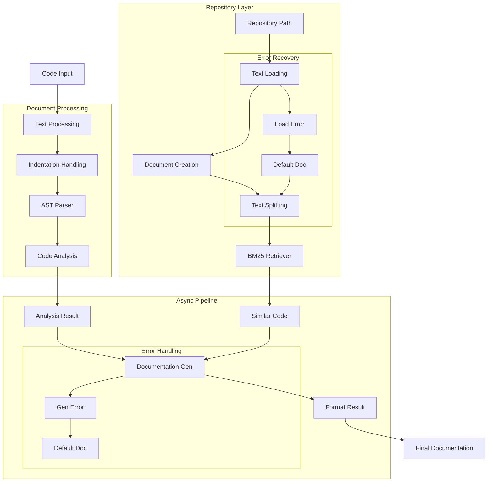

# Code Documentation Assistant (107) with LangChain: Complete Guide

## Introduction

This implementation demonstrates a code documentation assistant by combining three key LangChain v3 concepts:
1. Document Loaders: Handle code repositories and documentation
2. Retrievers: Find relevant code examples
3. Runnable Interface: Create composable pipelines

The system provides comprehensive code documentation support for development teams in banking.

### Real-World Application Value
- Code understanding
- Documentation automation
- Knowledge sharing
- Compliance tracking
- Security documentation

### System Architecture Overview


## Core LangChain Concepts

### 1. Document Processing
```python
def setup_retriever(self):
    """Initialize the document retriever."""
    try:
        docs = []
        for file_path in Path(self.repo_path).rglb("*.py"):
            try:
                loader = TextLoader(str(file_path))
                doc = loader.load()[0]
                doc.metadata["source"] = str(file_path)
                docs.append(doc)
            except Exception as e:
                print(f"Error loading {file_path}: {str(e)}")
        
        # Create default document if needed
        if not docs:
            docs = [Document(
                page_content="# Sample Python code",
                metadata={"source": "default.py"}
            )]
```

Features:
- Safe file loading
- Metadata tracking
- Error handling
- Default content

### 2. Code Analysis Pipeline
```python
def setup_pipelines(self):
    """Setup runnable pipelines for code analysis."""
    self.code_analyzer = (
        RunnablePassthrough()
        .assign(
            ast_tree=lambda x: ast.parse(textwrap.dedent(x["code"]))
        )
        .assign(
            analysis=lambda x: self._analyze_code(x["ast_tree"])
        )
    )
```

Benefits:
- Clean composition
- Safe parsing
- Error handling
- Clear structure

### 3. Async Documentation Flow
```python
async def get_documentation(self, code: str, analysis: CodeAnalysis) -> DocumentationSection:
    """Get documentation asynchronously."""
    similar_examples = self.retriever.invoke(code)
    return await self._generate_documentation(code, analysis, similar_examples)

async def document_code(self, code: str) -> DocumentationSection:
    """Generate documentation for provided code."""
    try:
        analysis_result = self.code_analyzer.invoke({"code": code})
        documentation = await self.get_documentation(
            code=code,
            analysis=analysis_result["analysis"]
        )
        return documentation
    except Exception as e:
        print(f"Error documenting code: {str(e)}")
        return DocumentationSection(...)
```

Capabilities:
- Proper async flow
- Error recovery
- Clear structure
- Type safety

## Implementation Components

### 1. Safe Repository Handling
```python
def __init__(self, repo_path: str):
    if not os.path.exists(repo_path):
        repo_path = "_temp_code"
        os.makedirs(repo_path, exist_ok=True)
        with open(os.path.join(repo_path, "sample.py"), "w") as f:
            f.write("# Sample code repository")
```

Key elements:
- Path validation
- Default creation
- Error prevention
- Safe initialization

### 2. Code Analysis
```python
def _analyze_code(self, ast_tree) -> CodeAnalysis:
    try:
        classes = []
        methods = []
        dependencies = []
        complexity = {"classes": 0, "methods": 0, "lines": 0}
        
        for node in ast.walk(ast_tree):
            if isinstance(node, ast.ClassDef):
                classes.append(node.name)
                complexity["classes"] += 1
            # ... additional analysis ...
            
        return CodeAnalysis(...)
    except Exception as e:
        return CodeAnalysis(
            class_name="ErrorAnalyzing",
            methods=[],
            dependencies=[],
            complexity={"classes": 0, "methods": 0, "lines": 0}
        )
```

Features:
- Safe parsing
- Complete analysis
- Error handling
- Default values

## Expected Output

### 1. Successful Analysis
```text
Documentation: TransactionProcessor

Content:
- Purpose and functionality
- Usage examples
- Dependencies
- Security considerations

Code Examples:
Language: python
Dependencies: logging, account_service
```

### 2. Error Recovery
```text
Documentation: Error

Content: Failed to process code: [error details]
Examples: []
References: []
```

## Best Practices

### 1. Code Processing
- Fix indentation
- Safe parsing
- Error recovery
- Clear feedback

### 2. Async Handling
- Proper coroutines
- Safe invocation
- Error management
- Result handling

### 3. Documentation
- Clear structure
- Complete content
- Proper examples
- Error information

## References

### 1. LangChain Core Concepts
- [Document Loaders](https://python.langchain.com/docs/modules/data_connection/document_loaders/)
- [Retrievers](https://python.langchain.com/docs/modules/data_connection/retrievers/)
- [Runnable](https://python.langchain.com/docs/modules/model_io/models/runnable)

### 2. Implementation Guides
- [Code Analysis](https://docs.python.org/3/library/ast.html)
- [Async Programming](https://docs.python.org/3/library/asyncio.html)
- [Error Handling](https://docs.python.org/3/tutorial/errors.html)

### 3. Additional Resources
- [Text Processing](https://docs.python.org/3/library/textwrap.html)
- [File Handling](https://docs.python.org/3/library/pathlib.html)
- [Documentation](https://python.langchain.com/docs/modules/model_io/prompts)