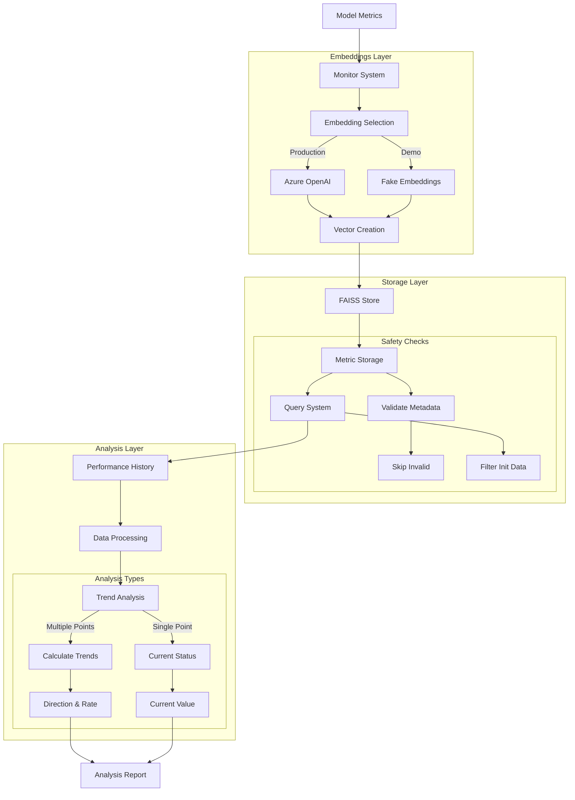

# Model Performance Monitor (108) with LangChain: Complete Guide

## Introduction

This implementation demonstrates a model performance monitoring system by combining three key LangChain v3 concepts:
1. Async: Handle concurrent model evaluations
2. Vector Stores: Store and query performance metrics
3. Embedding Models: Analyze performance patterns

The system provides comprehensive model monitoring support for data science teams in banking.

### Real-World Application Value
- Performance tracking
- Alert generation
- Trend analysis
- Compliance monitoring
- Model maintenance

### System Architecture Overview


## Core LangChain Concepts

### 1. Fake Embeddings for Testing
```python
class FakeEmbeddings(Embeddings):
    """Fake embeddings for demonstration."""
    def embed_documents(self, texts: List[str]) -> List[List[float]]:
        return [self._get_embedding() for _ in texts]
        
    def embed_query(self, text: str) -> List[float]:
        return self._get_embedding()
        
    def _get_embedding(self) -> List[float]:
        return list(np.random.normal(0, 0.1, self.size))
```

Features:
- Safe testing
- Consistent output
- No external dependencies
- Production-like behavior

### 2. Vector Store Usage
```python
def setup_vector_store(self):
    """Initialize the vector store."""
    try:
        self.vector_store = FAISS.from_texts(
            texts=["Initial document"],
            embedding=self.embeddings,
            metadatas=[{"init": True}]
        )
    except Exception as e:
        print(f"Error setting up vector store: {str(e)}")
        raise
```

Benefits:
- Safe initialization
- Clear metadata
- Error handling
- Status tracking

### 3. Trend Analysis
```python
# Multiple point analysis
if len(values) > 1:
    slope = (values[-1] - values[0]) / (len(values) - 1)
    trends[metric] = {
        "direction": "improving" if slope > 0 else "degrading",
        "change_rate": float(abs(slope)),
        "current_value": float(values[-1]),
        "previous_value": float(values[0])
    }
else:  # Single point analysis
    trends[metric] = {
        "current_value": float(values[0]),
        "trend": "insufficient_data"
    }
```

Capabilities:
- Multiple point handling
- Single point cases
- Clear metrics
- Safe calculations

## Implementation Components

### 1. Alert System
```python
class AlertConfig(BaseModel):
    """Schema for performance alerts."""
    metric: str = Field(description="Metric to monitor")
    threshold: float = Field(description="Alert threshold")
    condition: str = Field(description="Comparison condition")
    severity: str = Field(description="Alert severity")

async def check_alerts(self, metrics: ModelMetrics) -> List[PerformanceAlert]:
    """Check for performance alerts."""
    alerts = []
    for config in self.alert_configs:
        if triggered:
            similar_docs = self.vector_store.similarity_search(...)
            response = await self.llm.ainvoke(...)
            alerts.append(PerformanceAlert(...))
```

Key elements:
- Clear configuration
- Async processing
- Pattern matching
- AI recommendations

### 2. Data Management
```python
async def store_metrics(self, metrics: ModelMetrics):
    try:
        metadata = {
            "model_id": metrics.model_id,
            "timestamp": metrics.timestamp,
            **metrics.metrics
        }
        text_content = f"""
        Model: {metrics.model_id}
        Metrics: {json.dumps(metrics.metrics)}
        """
        self.vector_store.add_texts(...)
    except Exception as e:
        print(f"Error storing metrics: {str(e)}")
        raise
```

Features:
- Safe storage
- Clear metadata
- Error tracking
- Status updates

## Expected Output

### 1. Alert Generation
```text
Alert for credit_risk_v2:
Metric: accuracy
Current Value: 0.94
Threshold: 0.95
Severity: high

Recommendations:
- Review feature importance
- Check data quality
- Consider retraining
```

### 2. Performance Analysis
```json
{
  "model_id": "credit_risk_v2",
  "metrics_count": 1,
  "date_range": {
    "start": "2025-03-31T16:45:00",
    "end": "2025-03-31T16:45:00"
  },
  "trends": {
    "accuracy": {
      "current_value": 0.94,
      "trend": "insufficient_data"
    }
  }
}
```

## Best Practices

### 1. Testing Support
- Use fake embeddings
- Safe initialization
- Clear feedback
- Error handling

### 2. Data Processing
- Safe metadata
- Skip invalid data
- Clear metrics
- Error recovery

### 3. Analysis Flow
- Multiple cases
- Safe calculations
- Clear reporting
- Complete feedback

## References

### 1. LangChain Core Concepts
- [Vector Stores](https://python.langchain.com/docs/modules/data_connection/vectorstores/integrations/faiss)
- [Embeddings](https://python.langchain.com/docs/modules/data_connection/text_embedding/)
- [Async Operations](https://python.langchain.com/docs/modules/agents/async_agents)

### 2. Implementation Guides
- [FAISS Setup](https://python.langchain.com/docs/integrations/vectorstores/faiss)
- [Testing](https://python.langchain.com/docs/guides/testing)
- [Production](https://python.langchain.com/docs/guides/deployments)

### 3. Additional Resources
- [Performance](https://python.langchain.com/docs/guides/deployments/performance)
- [Error Handling](https://python.langchain.com/docs/guides/debugging)
- [Safety](https://python.langchain.com/docs/guides/safety)