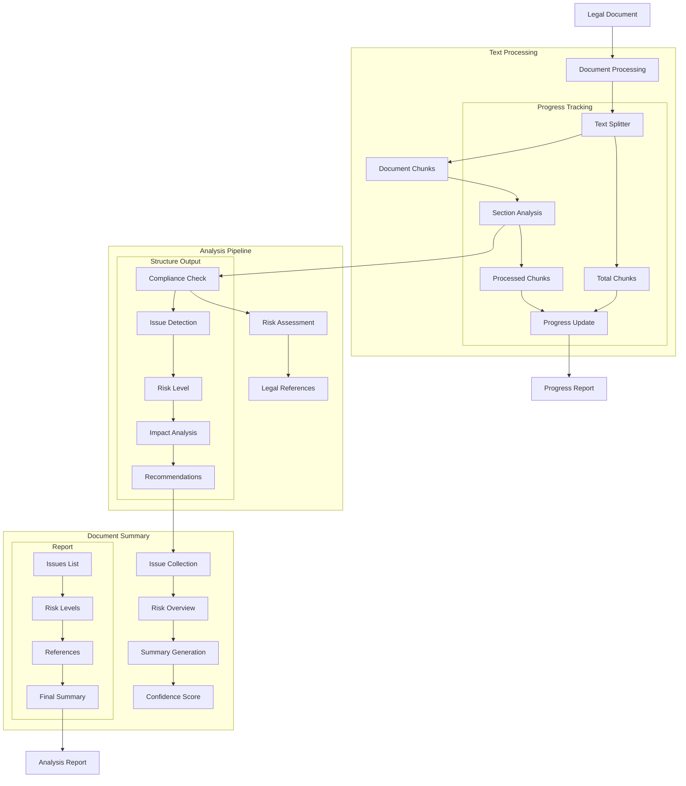

# Legal Document Analyzer (109) with LangChain: Complete Guide

## Introduction

This implementation demonstrates a legal document analysis system by combining three key LangChain v3 concepts:
1. Text Splitters: Smart document chunking
2. Output Parsers: Structured legal analysis
3. Callbacks: Progress tracking and logging

The system provides comprehensive document analysis support for legal teams in banking.

### Real-World Application Value
- Compliance checking
- Risk assessment
- Document analysis
- Legal reference tracking
- Progress monitoring

### System Architecture Overview


## Core LangChain Concepts

### 1. Text Splitting
```python
self.text_splitter = RecursiveCharacterTextSplitter(
    chunk_size=1000,
    chunk_overlap=100,
    separators=["\n\n", "\n", ". ", " "],
    keep_separator=True
)

# Split document into chunks
chunks = self.text_splitter.split_text(document)
```

Features:
- Smart chunking
- Context preservation
- Hierarchy respect
- Clean separation

### 2. Output Parsing
```python
class ComplianceIssue(BaseModel):
    """Schema for compliance issues."""
    issue: str = Field(description="Issue description")
    risk_level: RiskLevel = Field(description="Risk level")
    impact: str = Field(description="Potential impact")
    recommendation: str = Field(description="Recommended action")
    references: List[LegalReference] = Field(description="Related legal references")

# Initialize parser
self.output_parser = PydanticOutputParser(pydantic_object=ComplianceIssue)

# Parse response
issue = self.output_parser.parse(response.content)
```

Benefits:
- Structured analysis
- Type validation
- Clear schema
- Safe parsing

### 3. Progress Tracking
```python
class AnalysisProgressCallback(BaseCallbackHandler):
    """Callback handler for analysis progress tracking."""
    def on_llm_start(self, *args, **kwargs):
        print(f"\nAnalyzing section: {self.current_section}")

    def on_llm_end(self, *args, **kwargs):
        self.processed_chunks += 1
        progress = (self.processed_chunks / self.total_chunks) * 100
        print(f"Progress: {progress:.1f}%")
```

Capabilities:
- Real-time updates
- Error tracking
- Progress monitoring
- Status reporting

## Implementation Components

### 1. Document Types
```python
class DocumentType(str, Enum):
    """Types of legal documents."""
    CONTRACT = "contract"
    POLICY = "policy"
    REGULATION = "regulation"
    AGREEMENT = "agreement"
    DISCLOSURE = "disclosure"

class RiskLevel(str, Enum):
    """Risk levels for legal analysis."""
    LOW = "low"
    MEDIUM = "medium"
    HIGH = "high"
    CRITICAL = "critical"
```

Key elements:
- Clear categorization
- Risk assessment
- Type safety
- Documentation

### 2. Analysis Process
```python
async def analyze_document(self, document: str, document_id: str, 
                         document_type: DocumentType) -> DocumentAnalysis:
    # Split and analyze
    chunks = self.text_splitter.split_text(document)
    
    for chunk in chunks:
        # Analyze for compliance
        response = await self.llm.ainvoke([...])
        issue = self.output_parser.parse(response.content)
        
        if issue.risk_level != RiskLevel.LOW:
            issues.append(issue)
```

Features:
- Systematic analysis
- Risk filtering
- Progress tracking
- Error handling

## Expected Output

### 1. Compliance Issues
```json
{
  "issue": "Incomplete data encryption specification",
  "risk_level": "high",
  "impact": "Potential security vulnerabilities",
  "recommendation": "Specify encryption standards",
  "references": [
    {
      "section": "1.1",
      "requirement": "Data encryption requirement",
      "source": "GDPR Article 32"
    }
  ]
}
```

### 2. Analysis Report
```text
Document: POL-2025-001
Type: policy
Issues Found: 2
Risk Levels: [high, medium]
Confidence: 98.5%

Summary:
Document requires updates to meet current 
banking regulations...
```

## Best Practices

### 1. Document Processing
- Smart chunking
- Context preservation
- Progress tracking
- Error handling

### 2. Analysis Flow
- Risk assessment
- Reference tracking
- Clear reporting
- Complete feedback

### 3. Legal Compliance
- Regulation tracking
- Risk evaluation
- Clear recommendations
- Source references

## References

### 1. LangChain Core Concepts
- [Text Splitters](https://python.langchain.com/docs/modules/data_connection/document_transformers/)
- [Output Parsers](https://python.langchain.com/docs/modules/model_io/output_parsers/)
- [Callbacks](https://python.langchain.com/docs/modules/callbacks/)

### 2. Implementation Guides
- [Document Processing](https://python.langchain.com/docs/use_cases/question_answering/)
- [Schema Validation](https://python.langchain.com/docs/modules/model_io/output_parsers/pydantic)
- [Progress Tracking](https://python.langchain.com/docs/modules/callbacks/custom_callbacks)

### 3. Additional Resources
- [Legal AI Guide](https://python.langchain.com/docs/use_cases/extraction)
- [Banking Compliance](https://python.langchain.com/docs/use_cases/qa_structured/sql)
- [Document Analysis](https://python.langchain.com/docs/modules/data_connection/document_transformers/text_splitters/recursive_text_splitter)