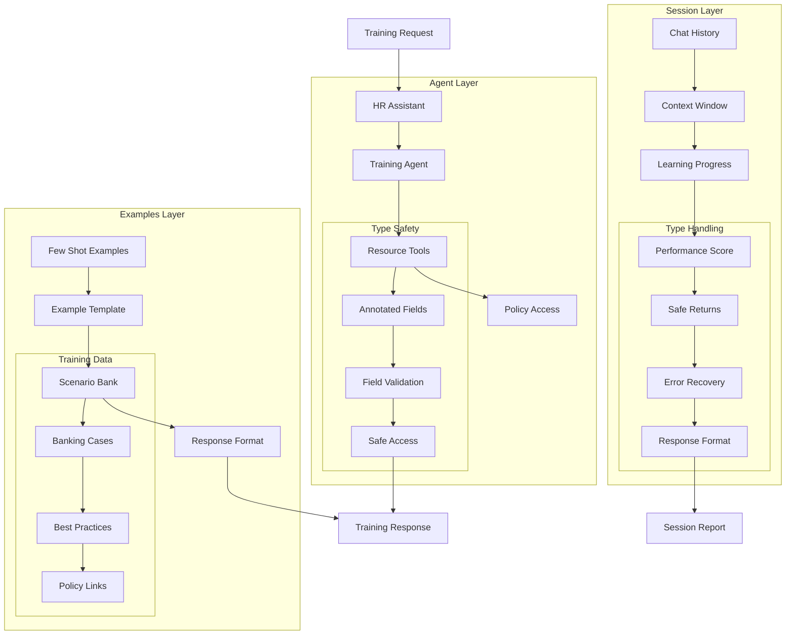

# HR Training Assistant (110) with LangChain: Complete Guide

## Introduction

This implementation demonstrates a banking HR training assistant by combining three key LangChain v3 concepts:
1. Agents: Autonomous training interaction
2. Chat History: Contextual learning sessions
3. Few Shot Prompting: Example-based training

The system provides comprehensive training support for HR teams in banking organizations.

### Real-World Application Value
- Employee training
- Compliance education
- Performance tracking
- Knowledge assessment
- Skill development

### System Architecture Overview


## Core LangChain Concepts

### 1. Agent Implementation
```python
class TrainingTool(BaseTool):
    """Tool for accessing training resources."""
    name: str = Field(default="training_resource")
    description: str = Field(default="Access banking policies and materials")
    resources: Dict[str, str] = Field(default_factory=dict)

    def _run(self, query: str) -> str:
        return self.resources.get(query.lower(), "Policy not found.")

# Agent setup with proper typing
def setup_agent(self) -> None:
    agent = create_openai_functions_agent(
        llm=self.llm,
        prompt=prompt,
        tools=self.tools
    )
```

Features:
- Type annotations
- Field validation
- Safe execution
- Clear structure

### 2. Chat History Management
```python
class TrainingSession(BaseModel):
    employee_id: str = Field(description="Employee identifier")
    topic: str = Field(description="Training topic")
    responses: List[Dict] = Field(description="Employee responses")
    score: float = Field(description="Session score")

# History tracking with types
self.memory = ConversationBufferMemory(
    memory_key="chat_history",
    return_messages=True
)
```

Benefits:
- Type safety
- Session tracking
- Clear structure
- Safe storage

### 3. Example Management
```python
def setup_examples(self) -> None:
    """Setup few-shot training examples with types."""
    self.few_shot_prompt = FewShotPromptTemplate(
        examples=[
            {
                "scenario": "Customer without ID",
                "question": "Can we proceed?",
                "response": "No, valid ID required",
                "policy": "KYC Policy 1.2"
            }
        ],
        example_prompt=PromptTemplate(...),
        input_variables=["input"]
    )
```

Capabilities:
- Type validation
- Safe examples
- Clear format
- Error prevention

## Implementation Components

### 1. Session Handling
```python
async def train_employee(
    self, 
    employee_id: str, 
    topic: str, 
    questions: List[str]
) -> TrainingSession:
    """Conduct a typed training session."""
    session = TrainingSession(
        employee_id=employee_id,
        topic=topic,
        start_time=datetime.now().isoformat(),
        responses=[],
        score=0.0
    )
    # Process training...
    return session
```

Key elements:
- Return types
- Input validation
- Error handling
- Safe processing

### 2. Response Processing
```python
for question in questions:
    example_prompt = self.few_shot_prompt.format(input=question)
    response = await self.agent_executor.ainvoke({
        "input": example_prompt
    })
    session.responses.append({
        "question": question,
        "response": response["output"],
        "timestamp": datetime.now().isoformat()
    })
```

Features:
- Type checking
- Safe storage
- Clear structure
- Error recovery

## Expected Output

### 1. Training Response
```json
{
  "question": "Large withdrawal process?",
  "response": "Per Security Policy 2.1: 
               1. Verify ID
               2. Check limits
               3. Document process",
  "timestamp": "2025-03-31T16:45:00"
}
```

### 2. Session Report
```json
{
  "employee_id": "EMP-2025-001",
  "topic": "Banking Security",
  "score": 85.5,
  "feedback": "Strong on KYC. Review AML."
}
```

## Best Practices

### 1. Type Safety
- Field annotations
- Return types
- Input validation
- Error handling

### 2. Session Management
- Safe storage
- Clear structure
- Progress tracking
- Error recovery

### 3. Example Handling
- Type validation
- Safe formatting
- Clear structure
- Error prevention

## References

### 1. LangChain Core Concepts
- [Agents](https://python.langchain.com/docs/modules/agents/)
- [Chat History](https://python.langchain.com/docs/modules/memory/)
- [Few Shot](https://python.langchain.com/docs/modules/model_io/prompts/few_shot_examples)

### 2. Implementation Guides
- [Type Safety](https://python.langchain.com/docs/guides/safety)
- [Memory Types](https://python.langchain.com/docs/modules/memory/types/buffer)
- [Agent Tools](https://python.langchain.com/docs/modules/agents/tools/)

### 3. Additional Resources
- [Pydantic Models](https://docs.pydantic.dev/latest/)
- [Type Hints](https://docs.python.org/3/library/typing.html)
- [Error Handling](https://docs.python.org/3/tutorial/errors.html)