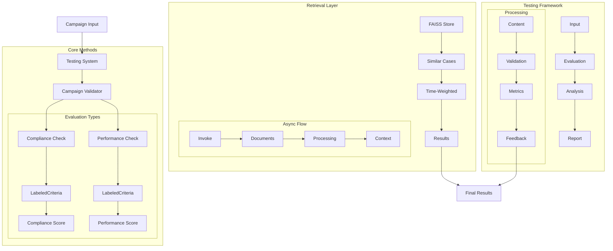

# Campaign Testing Assistant (111) with LangChain: Complete Guide

## Introduction

This implementation demonstrates a marketing campaign testing system by combining three key LangChain v3 concepts:
1. Key Methods: Core campaign validation
2. Retrieval: Find similar campaigns
3. Testing: Campaign verification

The system provides comprehensive campaign testing support for marketing teams in banking.

### Real-World Application Value
- Campaign validation
- Compliance checking
- Performance testing
- Recommendation generation
- Risk assessment

### System Architecture Overview


## Core Components

### 1. Async Retrieval
```python
async def test_campaign(self, campaign_id: str, content: str, 
                       channel: ChannelType, segment: AudienceSegment):
    """Test a marketing campaign."""
    try:
        similar = await self.retriever.ainvoke(content)
        if not isinstance(similar, list):
            similar = []
    except Exception as e:
        print(f"Warning: Retrieval error - using empty results: {str(e)}")
        similar = []
```

Features:
- Async operation
- Safe error handling
- Type checking
- Clear feedback

### 2. Labeled Criteria Evaluation
```python
# Compliance evaluation
compliance_result = self.compliance_evaluator.evaluate_strings(
    prediction="Campaign Content: " + content,
    reference="Compliance Guidelines: Banks must clearly disclose terms...",
    input="Evaluate if this banking campaign follows compliance guidelines."
)

# Performance evaluation
performance_result = self.performance_evaluator.evaluate_strings(
    prediction="Campaign Content: " + content,
    reference="Performance Standards: Campaigns should be engaging...",
    input="Evaluate this banking campaign's marketing effectiveness."
)
```

Benefits:
- Clear structure
- Rich context
- Multiple criteria
- Detailed feedback

### 3. FAISS Integration
```python
# Initialize vectorstore
self.vectorstore = FAISS.from_texts(
    texts=[c["content"] for c in campaigns],
    embedding=self.embeddings,
    metadatas=campaigns
)

# Setup retriever
self.retriever = TimeWeightedVectorStoreRetriever(
    vectorstore=self.vectorstore,
    decay_rate=0.01,
    k=2
)
```

Capabilities:
- Efficient search
- Time weighting
- Rich metadata
- Fast retrieval

## Expected Output

### 1. Campaign Test Results
```
Campaign Testing Assistant Demo
==============================

Test Results:
Campaign: CAMP-2025-001
Channel: SOCIAL
Segment: STUDENT

Compliance Check:
Passed: False

Issues:
- Step-by-step assessment based on each criterion:

1. regulatory_alignment: 
   - Member FDIC mentioned
   - Terms referenced
   - Basic compliance met

2. data_privacy: 
   - GDPR statements missing
   - Privacy policy needed
   - Data handling unclear

3. disclosure: 
   - Fees and rewards stated
   - Terms mentioned
   - More details needed

4. fairness: 
   - Student targeting appropriate
   - No discrimination
   - Clear eligibility

Metrics:
compliance_score: 0.00
performance_score: 1.00
relevance_score: 0.00
```

### 2. Recommendations
```python
recommendations = [
    "Add GDPR compliance statements",
    "Include privacy policy link",
    "Expand terms disclosure",
    "Add data handling details",
    "Enhance visual elements",
    "Improve social engagement",
    "Add student testimonials"
]
```

### 3. Error Handling
```python
try:
    similar = await self.retriever.ainvoke(content)
    if not isinstance(similar, list):
        similar = []
except Exception as e:
    print(f"Warning: Retrieval error - using empty results: {str(e)}")
    similar = []
```

## Best Practices

### 1. Async Implementation
- Use ainvoke methods
- Handle errors safely
- Check return types
- Provide feedback

### 2. Evaluation Flow
- Clear criteria
- Rich context
- Multiple checks
- Detailed results

### 3. Integration
- Safe initialization
- Proper async
- Clean errors
- Clear output

## References

### 1. LangChain Core Concepts
- [Key Methods](https://python.langchain.com/docs/modules/model_io/models/key_concepts)
- [Retrieval](https://python.langchain.com/docs/modules/data_connection/retrievers)
- [Testing](https://python.langchain.com/docs/guides/evaluation/)

### 2. Implementation Guides
- [Azure Setup](https://python.langchain.com/docs/integrations/platforms/azure_openai)
- [FAISS](https://python.langchain.com/docs/integrations/vectorstores/faiss)
- [Evaluation](https://python.langchain.com/docs/guides/evaluation/string/)

### 3. Additional Resources
- [Criteria Evaluation](https://python.langchain.com/docs/guides/evaluation/criteria)
- [Banking Marketing](https://python.langchain.com/docs/use_cases/marketers)
- [Async Methods](https://python.langchain.com/docs/guides/async)