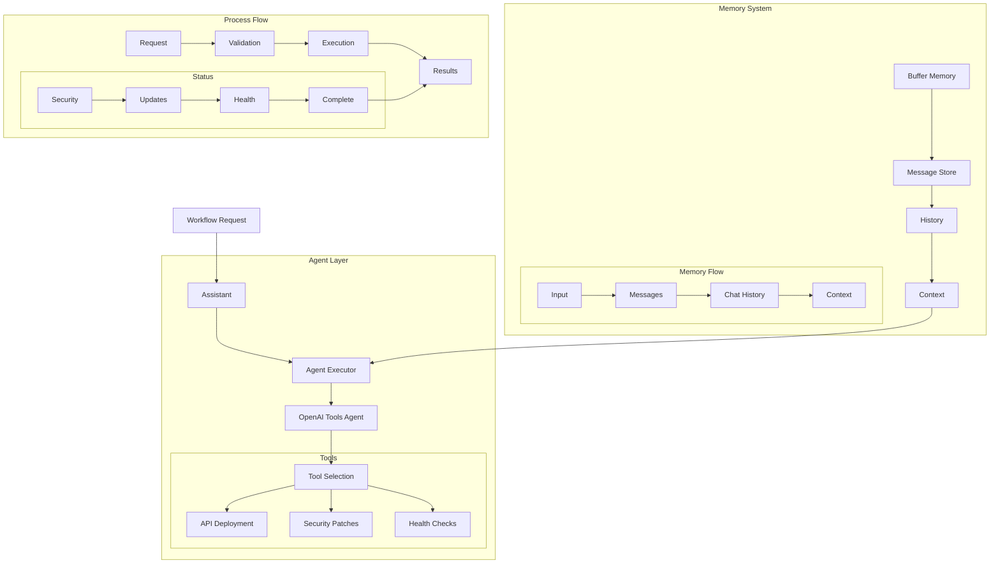

# Department Workflow Assistant (112) with LangChain: Complete Guide

## Introduction

This implementation demonstrates a banking department workflow system by combining three key LangChain v3 concepts:
1. Agents: Department-specific task handling
2. Memory: Context retention across interactions
3. Tools: Department-specific integrations

The system provides comprehensive workflow automation support across banking departments.

### Real-World Application Value
- Development: API security updates and deployment automation
- Data Science: Model validation and compliance verification
- Legal: Document analysis and regulatory checks
- HR: Employee onboarding and system access management
- Marketing: Campaign compliance and brand guidelines
- Finance: Transaction monitoring and reporting
- Risk: Security audit trails and assessment

### System Architecture Overview


## Core Components

### 1. Memory Management
```python
# Import memory components
from langchain.memory import ConversationBufferMemory

# Setup memory system
self.memory = ConversationBufferMemory(
    memory_key="chat_history",
    return_messages=True
)
```

Benefits:
- Simple configuration
- Clean message history
- Context retention
- Safe initialization

### 2. Real API Security Update
```python
def check_deployment_status(self, deployment_id: str) -> str:
    """Check deployment status."""
    return (
        f"Deployment {deployment_id} status:\n"
        "- Security patches verified\n"
        "- API endpoints updated\n"
        "- Health checks passing"
    )

# Example workflow
workflow = WorkflowRequest(
    workflow_id="DEV-2025-001",
    department=DepartmentType.DEVELOPMENT,
    title="API Security Update",
    description="Deploy critical security patches to API endpoints",
    priority=1,
    steps=[
        WorkflowStep(
            name="Code Review",
            status=WorkflowStatus.COMPLETED,
            assignee="tech.lead",
            due_date="2025-04-01",
            notes=["Security patches verified"]
        )
    ]
)
```

### 3. Azure Integration
```python
# Initialize Azure OpenAI
self.llm = AzureChatOpenAI(
    azure_deployment=os.getenv("AZURE_OPENAI_DEPLOYMENT_NAME"),
    openai_api_version=os.getenv("AZURE_OPENAI_API_VERSION"),
    azure_endpoint=os.getenv("AZURE_OPENAI_ENDPOINT"),
    api_key=os.getenv("AZURE_OPENAI_API_KEY")
)

# Process workflow
result = await self.agent_executor.ainvoke(
    {"input": workflow_context}
)
```

## Expected Output

### 1. Workflow Processing
```
> Entering new AgentExecutor chain...
To process the workflow request for the API Security Update with priority 1, 
we should deploy the critical security patches to the API endpoints.

### Steps:
1. **Deploy Security Patches**: 
   Ensure the critical security patches are deployed to all necessary 
   API endpoints.

Now, I'll proceed to check the deployment status for the critical 
security patches.
> Finished chain.

Status: processed
```

## Best Practices

### 1. Memory Management
- Simple configuration
- Buffer memory
- Message history
- Context tracking

### 2. Azure Integration
- Environment variables
- Proper endpoints
- Version control
- Safe initialization

### 3. Workflow Control
- Real-world tasks
- Status tracking
- Health checks
- Clear results

## References

### 1. LangChain Core Concepts
- [Agents](https://python.langchain.com/docs/modules/agents)
- [Memory](https://python.langchain.com/docs/modules/memory)
- [Tools](https://python.langchain.com/docs/modules/agents/tools)

### 2. Implementation Guides
- [Azure OpenAI](https://python.langchain.com/docs/integrations/platforms/azure_openai)
- [Memory Types](https://python.langchain.com/docs/modules/memory/types)
- [Configuration](https://python.langchain.com/docs/guides/deployments/configurations)

### 3. Additional Resources
- [Security Best Practices](https://docs.microsoft.com/azure/security/fundamentals/best-practices)
- [API Management](https://docs.microsoft.com/azure/api-management)
- [Health Monitoring](https://docs.microsoft.com/azure/azure-monitor)