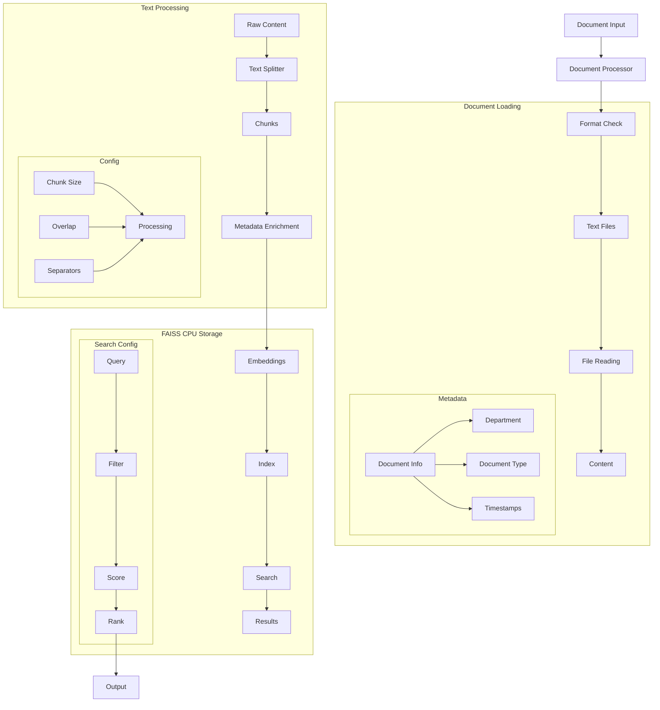

# Banking Document Processor (113) with LangChain: Complete Guide

## Introduction

This implementation demonstrates a banking document processing system by combining three key LangChain v3 concepts:
1. Document Loaders: Basic text file handling
2. Text Splitters: Smart document chunking
3. Vector Stores: Efficient retrieval with CPU FAISS

The system provides comprehensive document processing support across banking departments.

### Real-World Application Value
- Development: API documentation and specifications
- Legal: Compliance documents and policies
- HR: Policy manuals and procedures
- Marketing: Campaign materials and guidelines
- Finance: Reports and financial statements
- Risk: Audit reports and assessments

### System Architecture Overview


## Core Components

### 1. Document Loading
```python
def load_document(self, doc_info: BankingDocument) -> List[Document]:
    """Load document based on type."""
    try:
        ext = os.path.splitext(doc_info.filepath)[1].lower()
        if ext in ['.txt', '.md']:
            with open(doc_info.filepath, 'r', encoding='utf-8') as f:
                text = f.read()
                documents = [Document(page_content=text)]
        
        # Add metadata
        for doc in documents:
            doc.metadata.update({
                "doc_id": doc_info.doc_id,
                "title": doc_info.title,
                "department": doc_info.department.value
            })
        return documents
    except Exception as e:
        logger.error(f"Error loading document")
        raise
```

Benefits:
- Simple implementation
- Direct file reading
- Rich metadata
- Clean error handling

### 2. Text Processing
```python
# Configure environment
os.environ["FAISS_CPU_ONLY"] = "1"  # Force CPU-only FAISS
warnings.filterwarnings('ignore', category=UserWarning)

# Initialize processor
text_splitter = RecursiveCharacterTextSplitter(
    chunk_size=1000,
    chunk_overlap=200,
    separators=["\n\n", "\n", " ", ""]
)

# Process documents
chunks = text_splitter.split_documents(docs)
```

Features:
- CPU-only processing
- Smart chunking
- Clean configuration
- Clear output

### 3. Vector Store
```python
# Initialize embeddings
embeddings = AzureOpenAIEmbeddings(
    azure_deployment=os.getenv("AZURE_DEPLOYMENT"),
    model=os.getenv("AZURE_MODEL_NAME"),
    azure_endpoint=os.getenv("AZURE_OPENAI_ENDPOINT")
)

# Search with filters
results = vectorstore.similarity_search(
    query=query,
    filter={"department": department.value},
    k=2
)
```

Capabilities:
- Efficient storage
- Department filtering
- Fast retrieval
- Clean results

## Example Output

### Processing Documents
```
Banking Document Processor Demo
==============================

Processing documents...

Processing Metrics:
Total Documents: 3
Total Chunks: 5
Average Chunk Size: 685.60
Vector Store Size: 5
```

### Search Results
```
Search Results:

Document: Payment API Documentation
Content: # Payment API Documentation v2.0

## Overview
This document describes the secure payment processing API endpoints.

## Authentication
All requests must include a valid JWT token...

Document: Payment API Documentation
Content: ## Error Handling
All errors follow standard HTTP status codes:
- 400: Bad Request
- 401: Unauthorized
- 403: Forbidden
- 429: Too Many Requests...
```

## Best Practices

### 1. Setup
- CPU-only FAISS
- Clean logging
- Error handling
- Clear output

### 2. Processing
- Smart chunking
- Rich metadata
- Progress tracking
- Quality metrics

### 3. Search
- Department filters
- Top-k results
- Clear formatting
- Ranked output

## References

### 1. LangChain Core Concepts
- [Document Loaders](https://python.langchain.com/docs/modules/data_connection/document_loaders)
- [Text Splitters](https://python.langchain.com/docs/modules/data_connection/document_transformers)
- [Vector Stores](https://python.langchain.com/docs/modules/data_connection/vectorstores)

### 2. Implementation Guides
- [FAISS Guide](https://python.langchain.com/docs/integrations/vectorstores/faiss)
- [Azure OpenAI](https://python.langchain.com/docs/integrations/platforms/azure_openai)
- [Error Handling](https://python.langchain.com/docs/guides/debugging)

### 3. Additional Resources
- [Text Processing](https://docs.microsoft.com/azure/architecture/guide/textprocessing)
- [Vector Search](https://docs.microsoft.com/azure/search/vector-search-overview)
- [Document Analysis](https://docs.microsoft.com/azure/applied-ai-services/document-intelligence)