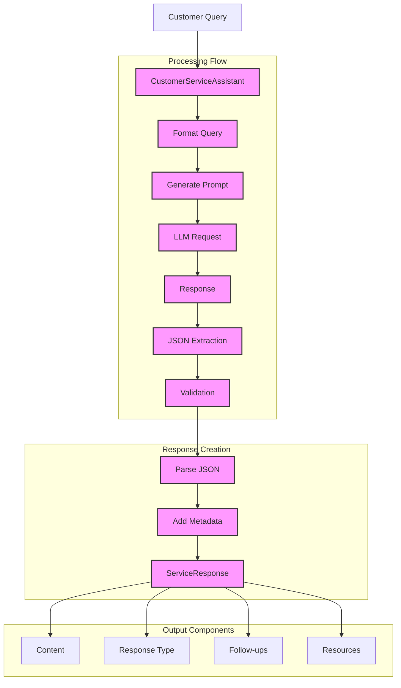

# Banking Customer Service Assistant (114)

The Banking Customer Service Assistant implements a comprehensive banking support system using LangChain's chat models, output parsing, and prompt engineering capabilities. It demonstrates how to create structured, department-specific responses for various banking queries.

## Concepts Covered

This example demonstrates three key LangChain concepts:

1. Chat Models
   - Natural language understanding
   - Context-aware responses
   - Multi-department support

2. Output Parsing
   - JSON structure validation
   - Type enforcement
   - Response formatting

3. Prompt Engineering
   - Clear instructions
   - Response templates
   - Format guidance

## Architecture



## Use Cases

The assistant supports these banking scenarios:

1. Technical Support
   - Password resets
   - Online banking setup
   - Transaction issues
   - Card management

2. Security Services
   - Fraud reporting
   - Suspicious activity
   - Account protection
   - Security settings

3. Product Information
   - Account features
   - Service offerings
   - Rate information
   - Fee schedules

## Implementation Details

The implementation focuses on:

1. Query Processing
   - Department routing
   - Priority handling
   - Metadata support
   - Error management

2. Response Formatting
   - JSON structure
   - Content validation
   - Follow-up actions
   - Resource links

3. Service Integration
   - Azure OpenAI
   - Async support
   - Error handling
   - Logging

## Expected Output

Running the example produces responses like:

```
Processing Query: TECH-2025-001
Content: How do I enable international transactions on my card?
Department: technical

Response:
Content: To enable international transactions on your card, you typically have two options. 
First, you can log into your online banking account and look for the card settings—there 
should be an option to enable international transactions there. Alternatively, you can 
contact your bank's customer service through their helpline or support email and request 
for the service to be activated.

Follow-up Actions:
- Check your bank's website or app for card settings
- Contact customer support for assistance

Helpful Resources:
- Bank's customer service phone number
- Bank's mobile app user guide
```

## Code Breakdown

1. Core Components:
```python
class CustomerServiceAssistant:
    def __init__(self):
        """Initialize assistant with Azure OpenAI."""
        self.llm = AzureChatOpenAI(...)
        self.setup_prompt()

    async def process_query(self, query: CustomerQuery) -> ServiceResponse:
        """Process customer query and return structured response."""
        formatted_prompt = self.prompt.format(input=query.content)
        response = await self.llm.ainvoke([HumanMessage(content=formatted_prompt)])
        return ServiceResponse(**response_data)
```

2. Query Structure:
```python
class CustomerQuery(BaseModel):
    query_id: str
    content: str
    department: DepartmentType
    priority: int
    metadata: Dict
```

3. Response Format:
```python
class ServiceResponse(BaseModel):
    response_id: str
    content: str
    response_type: ResponseType
    follow_up: List[str]
    resources: List[str]
```

## API Reference

The example uses these LangChain components:

1. Chat Models:
   - [AzureChatOpenAI](https://api.python.langchain.com/en/latest/chat_models/langchain_openai.chat_models.AzureChatOpenAI.html)
   - Message handling and response generation

2. Prompt Templates:
   - [PromptTemplate](https://api.python.langchain.com/en/latest/prompts/langchain.prompts.prompt.PromptTemplate.html)
   - Format configuration and validation

3. Core Types:
   - [BaseMessage](https://api.python.langchain.com/en/latest/schema/langchain.schema.messages.BaseMessage.html)
   - Message structure and handling

## Dependencies

Required packages:
```
langchain==0.1.0
langchain-openai==0.0.5
pydantic>=2.0
python-dotenv>=1.0
```

## Best Practices

1. Error Handling
   - Validate inputs
   - Handle JSON parsing
   - Provide clear errors
   - Log failures

2. Response Management
   - Structure outputs
   - Follow patterns
   - Include resources
   - Add metadata

3. Security
   - Hide credentials
   - Validate input
   - Check permissions
   - Log access

## Common Issues

1. Configuration
   - Missing environment variables
   - Invalid API keys
   - Wrong endpoints
   - Model access

2. Response Parsing
   - Invalid JSON
   - Missing fields
   - Wrong types
   - Empty responses

3. Error Messages
   - Unclear feedback
   - Missing context
   - No resolution
   - Hidden errors