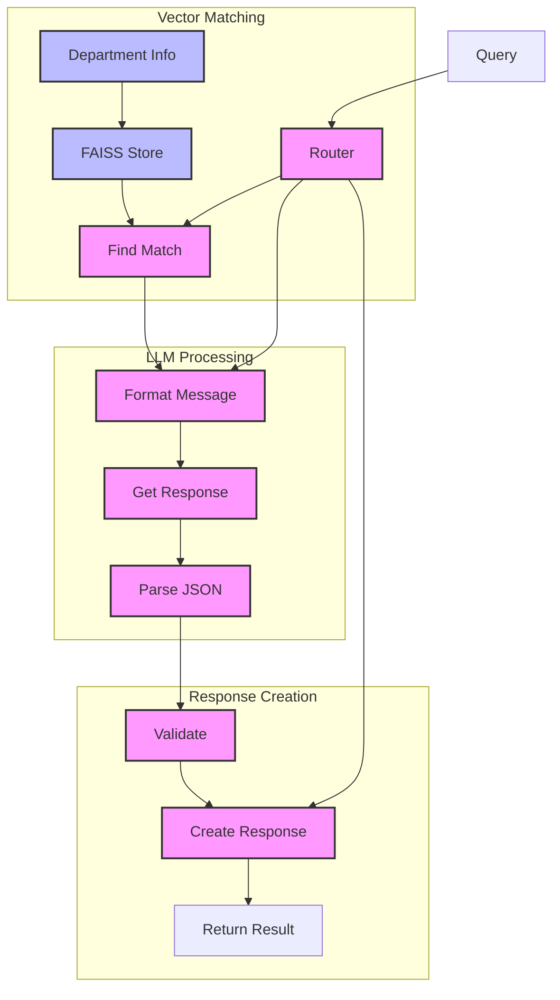

# Banking Department Router (115)

This example demonstrates an intelligent routing system for internal banking queries using LangChain's chat models, vector stores, and embeddings to automatically direct requests to the appropriate departments.

## Concepts Covered

This implementation showcases three key LangChain concepts:

1. Chat Models
   - Natural language query understanding
   - Structured JSON responses
   - Context-aware routing
   - Clear department assignments

2. Output Parsing
   - JSON response formatting
   - Type validation
   - Clean data extraction
   - Response structuring

3. Vector Store (FAISS-CPU)
   - Department matching
   - Similarity search
   - Text embeddings
   - Efficient routing

## System Architecture Overview



## Expected Output

Running the example produces responses like:

```
Query: DEV-001
From: Sarah Chen
Content: Need help implementing OAuth2 in our payment API

Routed to: development
Priority: high
Assigned: John Smith, Maria Garcia
Analysis: Technical request requiring API development expertise
Next Steps:
- Schedule technical planning meeting
- Review OAuth2 requirements
- Prepare implementation timeline
```

## Code Breakdown

Key components include:

1. Department Definitions:
```python
class Department(str, Enum):
    DEVELOPMENT = "development"
    DATA_SCIENCE = "data_science"
    LEGAL = "legal"
    HR = "hr"
    MARKETING = "marketing"
    RISK = "risk"
    COMPLIANCE = "compliance"
    OPERATIONS = "operations"
```

2. Query Structure:
```python
class Query(BaseModel):
    id: str
    content: str 
    sender: str
    priority: Priority
    metadata: Dict
```

3. Response Format:
```python
class Response(BaseModel):
    id: str
    query_id: str
    department: Department
    priority: Priority
    analysis: str
    assigned_to: List[str]
    next_steps: List[str]
```

## API Reference

The example uses these LangChain components:

1. Chat Models:
   - [AzureChatOpenAI](https://api.python.langchain.com/en/latest/chat_models/langchain_openai.chat_models.AzureChatOpenAI.html)
   - Natural language processing and routing

2. Embeddings:
   - [AzureOpenAIEmbeddings](https://api.python.langchain.com/en/latest/embeddings/langchain_openai.embeddings.AzureOpenAIEmbeddings.html)
   - Text similarity and matching

3. Vector Store:
   - [FAISS](https://api.python.langchain.com/en/latest/vectorstores/langchain_community.vectorstores.faiss.FAISS.html)
   - CPU-based similarity search

## Dependencies

Required packages:
```
langchain==0.1.0
langchain-openai==0.0.5
faiss-cpu>=1.7.4
pydantic>=2.0
python-dotenv>=1.0
```

## Best Practices

1. Query Processing
   - Clean input
   - Validate types
   - Handle nulls
   - Check priorities

2. Department Matching
   - Clear descriptions
   - Good coverage
   - Simple mapping
   - Proper weights

3. Response Generation
   - Valid JSON
   - Required fields
   - Clear steps
   - Good context

## Common Issues

1. Configuration
   - Missing env vars
   - Wrong endpoints
   - Invalid keys
   - Deployment names

2. Vector Search
   - Poor matches
   - Wrong dept
   - Low scores
   - Bad metadata

3. Response Parsing
   - Bad JSON
   - Missing fields
   - Wrong types
   - Invalid values