# Banking Task Prioritizer (116)

This example demonstrates a sophisticated task prioritization system for banking operations using LangChain's chat models, structured output, and Pydantic validation. The system helps bank departments efficiently prioritize tasks based on impact, urgency, and available resources.

## Concepts Covered

This implementation showcases three key LangChain concepts:

1. Chat Models
   - Task analysis and scoring
   - Clean JSON responses
   - Consistent formatting
   - Reliable output

2. Structured Output
   - JSON extraction
   - Data validation
   - Clean parsing
   - Error recovery

3. Pydantic Models (v2)
   - Field validation
   - Score bounds
   - Type checking
   - Safe conversion

## System Architecture Overview

```mermaid
graph TD
    A[Banking Task] --> B[Task Prioritizer]
    
    subgraph Analysis
        B --> C[Prepare Data]
        C --> D[Analysis Prompt]
        D --> E[Chat Model]
        E --> F[Raw Response]
        F --> G[Extract JSON]
        G --> H[Validate Analysis]
    end
    
    subgraph Priority
        H --> I[Format Input]
        I --> J[Priority Prompt]
        J --> K[Chat Model]
        K --> L[Raw Response]
        L --> M[Extract JSON]
        M --> N[Validate Priority]
    end
    
    subgraph Weighting
        O[Department Table] --> P[Weight System]
        P --> Q[Security: 1.5]
        P --> R[Compliance: 1.4]
        P --> S[Risk: 1.3]
        P --> T[Finance: 1.2]
        P --> U[Others: ≤1.0]
        Q,R,S,T,U --> I
    end

    classDef process fill:#f9f,stroke:#333,stroke-width:2px;
    classDef weight fill:#bbf,stroke:#333,stroke-width:2px;
    class B,C,D,E,F,G,H,I,J,K,L,M,N process;
    class O,P,Q,R,S,T,U weight;
```



## Expected Output

Running the example produces responses like:

```
Processing Task: SEC-001
Title: OAuth2 Security Update
Department: security

Getting task analysis...
Analysis complete:
Impact: critical
Urgency: 9/10
Complexity: 8/10

Calculating priority...
Department weight: 1.5
Priority set:
Score: 95/100
Impact: critical

Recommendations:
1. Schedule immediate security review
2. Prepare implementation plan
3. Setup monitoring system

Required Resources:
- Security engineering team
- OAuth2 specialists
- Test environment

Timeline: Complete within 1 week
Escalation: CISO approval required
--------------------------------------------------
```

## Code Breakdown

Key components include:

1. Task Model:
```python
class BankingTask(BaseModel):
    task_id: str
    title: str
    description: str
    department: Department
    type: TaskType
    deadline: Optional[str]
    resources: List[str]
    stakeholders: List[str]
```

2. Analysis Model:
```python
class TaskAnalysis(BaseModel):
    impact: Impact
    urgency_score: int
    complexity: int
    resource_demand: int
    dependencies: List[str]
    risks: List[str]

    @field_validator('urgency_score')
    @classmethod
    def validate_score(cls, v: int) -> int:
        if not 1 <= v <= 10:
            raise ValueError("Score must be between 1 and 10")
        return v
```

3. Priority Model:
```python
class TaskPriority(BaseModel):
    task_id: str
    priority_score: int
    impact_level: Impact
    recommendations: List[str]
    required_resources: List[str]
    timeline: str
    escalation_level: str

    @field_validator('priority_score')
    @classmethod
    def validate_priority(cls, v: int) -> int:
        if not 1 <= v <= 100:
            raise ValueError("Score must be between 1 and 100")
        return v
```

## API Reference

The example uses these LangChain components:

1. Chat Models:
   - [AzureChatOpenAI](https://api.python.langchain.com/en/latest/chat_models/langchain_openai.chat_models.AzureChatOpenAI.html)
   - Task analysis and prioritization

2. Prompts:
   - [ChatPromptTemplate](https://api.python.langchain.com/en/latest/prompts/langchain_core.prompts.chat.ChatPromptTemplate.html)
   - Clean message formatting

3. Messages:
   - [SystemMessage](https://api.python.langchain.com/en/latest/messages/langchain_core.messages.system.SystemMessage.html)
   - [HumanMessage](https://api.python.langchain.com/en/latest/messages/langchain_core.messages.human.HumanMessage.html)
   - Proper message handling

## Dependencies

Required packages:
```
langchain==0.1.0
langchain-openai==0.0.5
pydantic>=2.0
python-dotenv>=1.0
```

## Best Practices

1. Data Handling
   - Clean inputs
   - Validate types
   - Check ranges
   - Handle nulls

2. JSON Processing
   - Safe extraction
   - Clean parsing
   - Error recovery
   - Valid format

3. Error Management
   - Clear messages
   - Good context
   - Proper logging
   - Recovery steps

## Common Issues

1. Setup
   - Missing variables
   - Wrong endpoints
   - Bad keys
   - Model access

2. Processing
   - Bad JSON
   - Invalid scores
   - Wrong types
   - Missing fields

3. Response
   - Parse errors
   - Range issues
   - Format problems
   - Validation fails