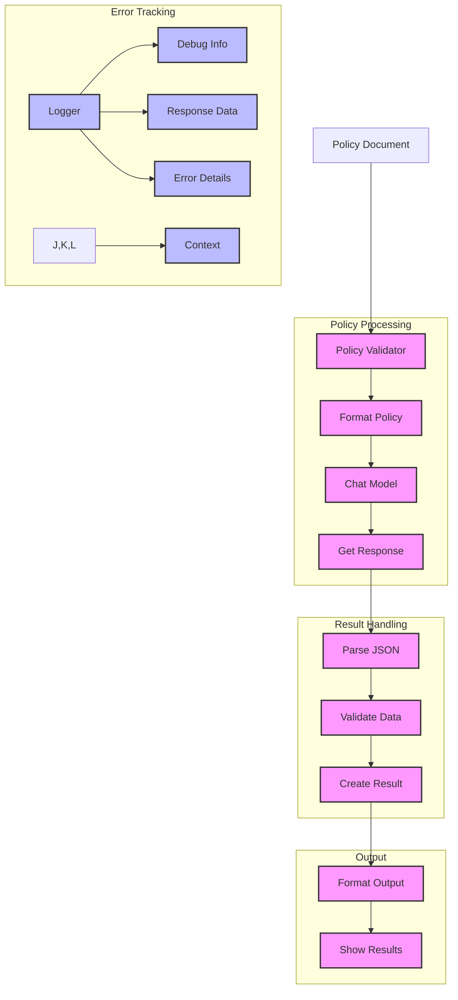

# Banking Policy Validator (117)

This example demonstrates a policy validation system for banking operations using LangChain's chat models and function-calling patterns. The system helps ensure that various department policies meet regulatory requirements with simple validation and clear feedback.

## Concepts Covered

This implementation showcases three key LangChain concepts:

1. Chat Models
   - Policy validation
   - Simple prompts
   - Clear responses
   - Function calling

2. Data Models
   - Policy documents
   - Validation issues
   - Results format
   - Type checking

3. Debug Logging
   - Progress tracking
   - Error handling
   - Response data
   - Context info

## System Architecture Overview



## Expected Output

Running the example produces responses like:

```
13:10:23 - DEBUG - Starting validator...
13:10:23 - DEBUG - Chat model ready
13:10:23 - DEBUG - Prompt template ready

Validating Security Policy
========================
Title: API Security Policy
Department: security
Type: security

13:10:24 - DEBUG - Processing policy: API Security Policy
13:10:24 - DEBUG - Request formatted
13:10:24 - DEBUG - Got response:
{
  "valid": true,
  "score": 85,
  "issues": [{
    "section": "2. Authorization",
    "issue": "RBAC details missing",
    "severity": "medium",
    "recommendation": "Add role matrix",
    "reference": "SEC-023"
  }],
  "summary": "Policy meets main requirements",
  "next_steps": ["Add RBAC details"],
  "review_date": "2025-06-01"
}

13:10:24 - INFO - ✓ Score: 85/100

Validation Results:
Valid: ✓
Score: 85/100
Summary: Policy meets main requirements

Issues Found:
1. Section: 2. Authorization
   Severity: medium
   Issue: RBAC details missing
   Fix: Add role matrix
   Ref: SEC-023

Next Steps:
1. Add RBAC details

Next Review: 2025-06-01
```

## Code Breakdown

Key components include:

1. Data Models:
```python
class ValidationIssue(BaseModel):
    section: str = Field(description="Section name")
    issue: str = Field(description="Issue description")
    severity: str = Field(description="low/medium/high/critical")
    recommendation: str = Field(description="Fix recommendation")
    reference: str = Field(description="Reference ID")

class ValidationResult(BaseModel):
    valid: bool = Field(description="Overall validity")
    score: int = Field(description="Score from 0-100")
    issues: List[ValidationIssue] = Field(description="Found issues")
    summary: str = Field(description="Brief summary")
    next_steps: List[str] = Field(description="Required actions")
    review_date: str = Field(description="YYYY-MM-DD")
```

2. Prompts:
```python
SYSTEM_PROMPT = """You are a banking policy validator.
Follow these rules:
1. Return ONLY a JSON object
2. No text before/after JSON
3. Use this format:
{
  "valid": true/false,
  "score": number 0-100,
  "issues": [...],
  "summary": "brief text",
  "next_steps": ["action 1"],
  "review_date": "YYYY-MM-DD"
}"""

HUMAN_PROMPT = """Review this policy:
TITLE: {title}
TYPE: {type} policy
DEPT: {department}
CONTENT: {content}
"""
```

3. Validation:
```python
async def validate(self, policy: PolicyDocument) -> ValidationResult:
    try:
        # Get validation
        messages = self.prompt.format_messages(
            title=policy.title,
            type=policy.type.value,
            department=policy.department.value,
            content=policy.content
        )
        response = await self.llm.ainvoke(messages)
        
        # Parse result
        data = json.loads(response.content)
        result = ValidationResult(**data)
        return result
        
    except Exception as e:
        logger.error(f"❌ Validation failed: {str(e)}")
        raise
```

## API Reference

The example uses these LangChain components:

1. Chat Models:
   - [AzureChatOpenAI](https://api.python.langchain.com/en/latest/chat_models/langchain_openai.chat_models.AzureChatOpenAI.html)
   - Policy validation

2. Prompts:
   - [ChatPromptTemplate](https://api.python.langchain.com/en/latest/prompts/langchain_core.prompts.chat.ChatPromptTemplate.html)
   - Message formatting

3. Messages:
   - [SystemMessage](https://api.python.langchain.com/en/latest/messages/langchain_core.messages.system.SystemMessage.html)
   - [HumanMessage](https://api.python.langchain.com/en/latest/messages/langchain_core.messages.human.HumanMessage.html)
   - Message handling

## Dependencies

Required packages:
```
langchain==0.1.0
langchain-openai==0.0.5
pydantic>=2.0
python-dotenv>=1.0
```

## Best Practices

1. Function Calling
   - Clear format
   - Simple JSON
   - Direct parsing
   - Type validation

2. Error Handling
   - Debug logging
   - Error context
   - Response data
   - Clear messages

3. Result Handling
   - Type checking
   - Field validation
   - Safe parsing
   - Clean output

## Common Issues

1. Setup
   - Missing keys
   - Wrong endpoint
   - Bad access
   - Model errors

2. Parsing
   - Bad JSON
   - Missing fields
   - Wrong types
   - Format issues

3. Validation
   - Score range
   - Required fields
   - Data types
   - Field formats