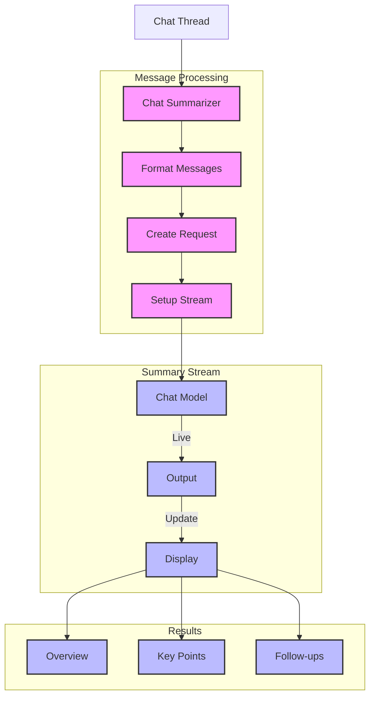

# Chat Summarizer (117)

This example demonstrates a chat summarization system using LangChain's chat models and streaming output. The system helps teams understand key points from chat conversations with clear, structured summaries.

## Concepts Covered

This implementation showcases three key LangChain concepts:

1. Message Handling
   - Chat messages
   - Message types
   - Thread organization
   - Clean formatting

2. Streaming Output
   - Live updates
   - Real-time display
   - Async handling
   - Progress tracking

3. Clear Summaries
   - Key points
   - Action items
   - Next steps
   - Follow-ups

## System Architecture Overview



## Expected Output

Running the example produces responses like:

```
Processing Chat Thread
===================
Title: API Design Discussion
Participants: Alice (Tech Lead), Bob (Developer), Carol (PM)
Messages: 10

Generating Summary...
==================

1. Overview
- Discussion about API authentication and security
- Time: 14:02 to 14:11 (9 minutes)
- All team members actively participated

2. Key Points
Authentication:
- Decided on OAuth 2.0 with JWT tokens
- Sliding refresh tokens with 7-day expiry
- Will leverage existing user database
- New tokens table required

Security:
- Rate limiting to be implemented
- Using token bucket algorithm
- 100 requests per minute limit
- Integration with user system confirmed

3. Follow-ups
Action Items:
- Technical spec to be created
- Alice to draft and share tomorrow
- Team review of spec needed

Open Items:
- Refresh token implementation details
- Rate limit monitoring approach
- Database schema updates

Next Steps:
1. Alice: Create technical spec (Due: Tomorrow)
2. Team: Review spec
3. Bob: Plan token handling
4. Carol: Confirm requirements met
```

## Code Breakdown

Key components include:

1. Message Types:
```python
class MessageType(str, Enum):
    QUESTION = "question"
    ANSWER = "answer"
    FOLLOW_UP = "follow_up"
    CLARIFICATION = "clarification"
    CONCLUSION = "conclusion"

class ChatMessage(BaseModel):
    speaker: str = Field(description="Speaker name")
    type: MessageType = Field(description="Message type")
    content: str = Field(description="Message content")
    timestamp: str = Field(description="Message time")
```

2. Streaming Setup:
```python
llm = AzureChatOpenAI(
    deployment_name=os.getenv("AZURE_OPENAI_DEPLOYMENT_NAME"),
    temperature=0,
    streaming=True,
    callbacks=[StreamingStdOutCallbackHandler()]
)
```

3. Message Processing:
```python
def format_messages(self, thread: ChatThread) -> str:
    messages = []
    for msg in thread.messages:
        messages.append(
            f"[{msg.timestamp}] {msg.speaker} ({msg.type}):\n{msg.content}\n"
        )
    return "\n".join(messages)
```

## API Reference

The example uses these LangChain components:

1. Chat Models:
   - [AzureChatOpenAI](https://api.python.langchain.com/en/latest/chat_models/langchain_openai.chat_models.AzureChatOpenAI.html)
   - Summary generation

2. Streaming:
   - [StreamingStdOutCallbackHandler](https://api.python.langchain.com/en/latest/callbacks/langchain.callbacks.streaming_stdout.StreamingStdOutCallbackHandler.html)
   - Live output

3. Message Templates:
   - [ChatPromptTemplate](https://api.python.langchain.com/en/latest/prompts/langchain_core.prompts.chat.ChatPromptTemplate.html)
   - Format handling

## Dependencies

Required packages:
```
langchain==0.1.0
langchain-openai==0.0.5
pydantic>=2.0
python-dotenv>=1.0
```

## Best Practices

1. Message Handling
   - Clear types
   - Clean format
   - Good structure
   - Easy reading

2. Streaming
   - Live updates
   - Clear output
   - Progress show
   - Error handling

3. Summaries
   - Key points
   - Clear sections
   - Action items
   - Next steps

## Common Issues

1. Setup
   - Missing keys
   - Bad endpoint
   - Wrong access
   - Stream errors

2. Messages
   - Bad format
   - Wrong types
   - Missing data
   - Time issues

3. Streaming
   - Connection loss
   - Buffer issues
   - Display errors
   - Update fails