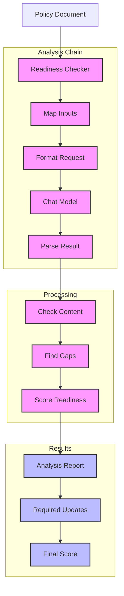

# Policy Readiness Checker (117)

This example demonstrates a policy readiness assessment system using LangChain's chat models and chain of thought processing. The system helps teams evaluate and improve their policy documents with actionable feedback.

## Concepts Covered

This implementation showcases three key LangChain concepts:

1. Chat Models
   - Policy analysis
   - Content evaluation
   - Clear feedback
   - Detailed output

2. Chain Building
   - Simple chains
   - Input mapping
   - Output parsing
   - Flow control

3. Document Processing
   - Content handling
   - Text analysis
   - Structure checking
   - Format review

## System Architecture Overview



## Expected Output

Running the example produces responses like:

```
Checking Policy Readiness
========================
Title: Data Access Control Policy
Department: security
Type: security

Readiness Analysis:
------------------
Overall Assessment:
The policy demonstrates good coverage of essential security controls but requires additional detail in specific areas.

Key Findings:
1. Strong authentication framework
   + MFA requirement clearly stated
   + Password rules included
   + Session controls defined

2. Access management basics covered
   + RBAC implementation
   + Review process mentioned
   + Account lifecycle included

3. Data handling framework present
   + Classification approach defined
   + Labeling requirements included
   + Storage guidelines provided

Required Updates:
1. Access Management
   - Add role definition process
   - Include delegation procedures
   - Define review frequency

2. Authentication
   - Specify password requirements
   - Add recovery procedures
   - Define MFA methods

3. Data Classification
   - Add classification levels
   - Include handling matrix
   - Define review process

4. Compliance
   - Specify audit frequency
   - Add reporting templates
   - Include escalation paths

Readiness Score: 75%
The policy provides a solid foundation but needs additional detail and specific procedures to be fully operational.
```

## Code Breakdown

Key components include:

1. Chain Creation:
```python
analyzer_chain = (
    {"title": RunnablePassthrough(), 
     "department": RunnablePassthrough(),
     "type": RunnablePassthrough(),
     "content": RunnablePassthrough()} 
    | analyzer_prompt 
    | llm 
    | StrOutputParser()
)
```

2. Analysis Prompt:
```python
analyzer_prompt = ChatPromptTemplate.from_messages([
    ("system", """You are a policy analyst. Given a policy document:
1. Assess its readiness and structure
2. Identify gaps and weaknesses
3. Suggest concrete improvements
4. Estimate completion percentage

Your response should be a clear report with:
- Overall Assessment 
- Key Findings
- Required Updates
- Readiness Score (0-100%)"""),
    ("human", """Please analyze this policy:
Title: {title}
Department: {department}
Type: {type}
Content: {content}""")
])
```

3. Processing:
```python
async def check_policy(self, policy: PolicyDocument) -> str:
    # Run analysis
    result = await self.chain.ainvoke({
        "title": policy.title,
        "department": policy.department.value,
        "type": policy.type.value,
        "content": policy.content.strip()
    })
    return result
```

## API Reference

The example uses these LangChain components:

1. Chat Models:
   - [AzureChatOpenAI](https://api.python.langchain.com/en/latest/chat_models/langchain_openai.chat_models.AzureChatOpenAI.html)
   - Policy analysis

2. Chain Components:
   - [RunnablePassthrough](https://api.python.langchain.com/en/latest/runnables/langchain_core.runnables.base.RunnablePassthrough.html)
   - Input mapping

3. Output Parsing:
   - [StrOutputParser](https://api.python.langchain.com/en/latest/output_parsers/langchain_core.output_parsers.string.StrOutputParser.html)
   - Text output

## Dependencies

Required packages:
```
langchain==0.1.0
langchain-openai==0.0.5
pydantic>=2.0
python-dotenv>=1.0
```

## Best Practices

1. Chain Building
   - Simple design
   - Clear flow
   - Error handling
   - Input mapping

2. Analysis
   - Clear prompts
   - Structured output
   - Actionable feedback
   - Scoring system

3. Error Management
   - Clean errors
   - Progress tracking
   - Status updates
   - Recovery steps

## Common Issues

1. Setup
   - Missing keys
   - Wrong endpoint
   - Bad access
   - Model errors

2. Analysis
   - Bad content
   - Missing sections
   - Poor structure
   - Format issues

3. Results
   - Unclear feedback
   - Missing details
   - Bad scoring
   - Wrong format