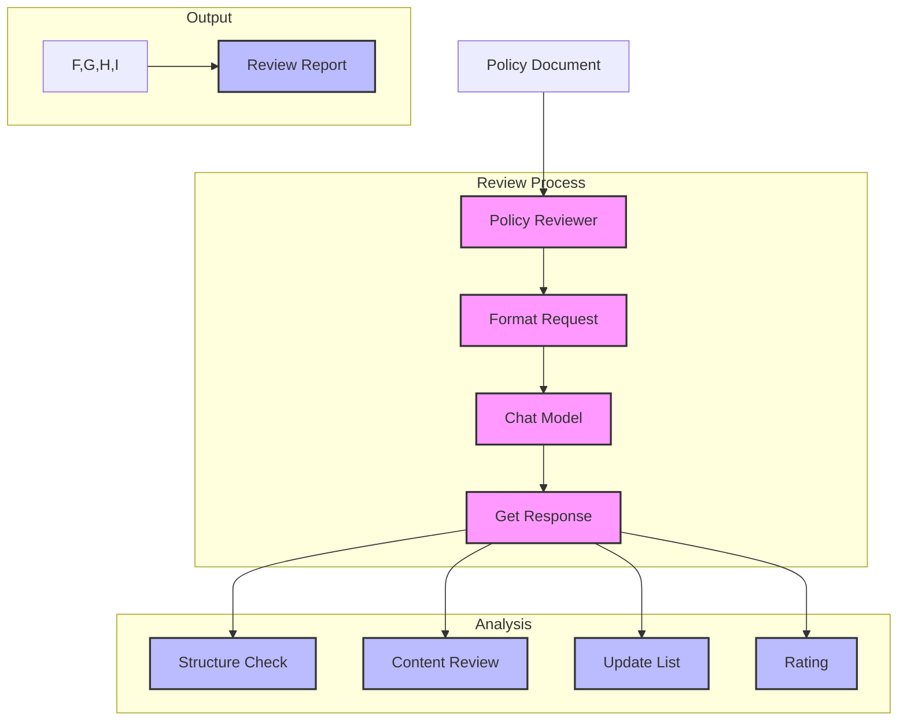

# Simple Policy Reviewer (117)

This example demonstrates a policy review system using LangChain's chat models and clear prompts. The system helps teams evaluate and improve their policy documents with straightforward feedback.

## Concepts Covered

This implementation showcases three key LangChain concepts:

1. Chat Models
   - Policy review
   - Content analysis
   - Clear feedback
   - Direct output

2. Simple Prompts
   - Clear instructions
   - Structured review
   - Direct questions
   - Clean format

3. Basic Chains
   - Single step
   - Text output
   - Error handling
   - Progress tracking

## System Architecture Overview



## Expected Output

Running the example produces responses like:

```
Reviewing Policy
===============
Title: Remote Access Security Policy
Department: security
Type: security

Policy Review:
-------------
1. Structure Review:
- Well-organized in clear sections
- Good hierarchical structure
- Consistent formatting with bullet points
- Clear section numbering

2. Content Analysis:
- Requirements are specific and actionable
- Security controls clearly defined
- User responsibilities well outlined
- Good coverage of key areas

3. Required Updates:
a) Access Requirements
   - Add specific VPN configuration details
   - Include approved MFA methods
   - Define minimum encryption standards

b) Device Security
   - Specify required antivirus solutions
   - Add patch management timeline
   - Include device compliance checks

c) Monitoring
   - Add review frequency
   - Include audit procedures
   - Define escalation process

4. Overall Rating: 85/100
Strong foundation with good structure and core requirements.
Clear and actionable but needs more specific details.

Top Priorities:
1. Add technical specifications
2. Define compliance timelines
3. Include audit procedures
```

## Code Breakdown

Key components include:

1. Policy Model:
```python
class PolicyDocument(BaseModel):
    title: str = Field(description="Policy title")
    department: Department = Field(description="Department")
    type: PolicyType = Field(description="Policy type")
    content: str = Field(description="Content")
```

2. Review Prompt:
```python
prompt = ChatPromptTemplate.from_messages([
    ("system", """You are a policy reviewer.
Include in your review:

1. Structure Review
- Is the policy organized?
- Are sections clear?
- Is formatting consistent?

2. Content Analysis
- Is content specific?
- Are requirements clear?
- Are responsibilities defined?

3. Required Updates
- What needs work?
- What's missing?
- What to add?

4. Overall Rating
- Score (0-100)
- Explanation
- Priorities"""),
    ("human", "Review this policy:\n{content}")
])
```

3. Review Process:
```python
async def review_policy(self, policy: PolicyDocument) -> str:
    try:
        # Format request
        messages = self.prompt.format_messages(
            title=policy.title,
            department=policy.department.value,
            type=policy.type.value,
            content=policy.content.strip()
        )
        
        # Get review
        response = await self.llm.ainvoke(messages)
        return response.content
        
    except Exception as e:
        logger.error(f"Review failed: {str(e)}")
        raise
```

## API Reference

The example uses these LangChain components:

1. Chat Models:
   - [AzureChatOpenAI](https://api.python.langchain.com/en/latest/chat_models/langchain_openai.chat_models.AzureChatOpenAI.html)
   - Policy review

2. Message Templates:
   - [ChatPromptTemplate](https://api.python.langchain.com/en/latest/prompts/langchain_core.prompts.chat.ChatPromptTemplate.html)
   - Clean formatting

3. Messages:
   - [SystemMessage](https://api.python.langchain.com/en/latest/messages/langchain_core.messages.system.SystemMessage.html)
   - [HumanMessage](https://api.python.langchain.com/en/latest/messages/langchain_core.messages.human.HumanMessage.html)
   - Message handling

## Dependencies

Required packages:
```
langchain==0.1.0
langchain-openai==0.0.5
pydantic>=2.0
python-dotenv>=1.0
```

## Best Practices

1. Prompts
   - Clear structure
   - Simple format
   - Direct questions
   - Clean output

2. Models
   - Basic types
   - Clear fields
   - Simple validation
   - Clean data

3. Error Handling
   - Basic checks
   - Clear messages
   - Simple recovery
   - Status updates

## Common Issues

1. Setup
   - Missing keys
   - Wrong endpoint
   - Bad access
   - Model errors

2. Content
   - Bad format
   - Missing data
   - Empty sections
   - Poor structure

3. Results
   - Unclear feedback
   - Bad format
   - Missing sections
   - Wrong structure