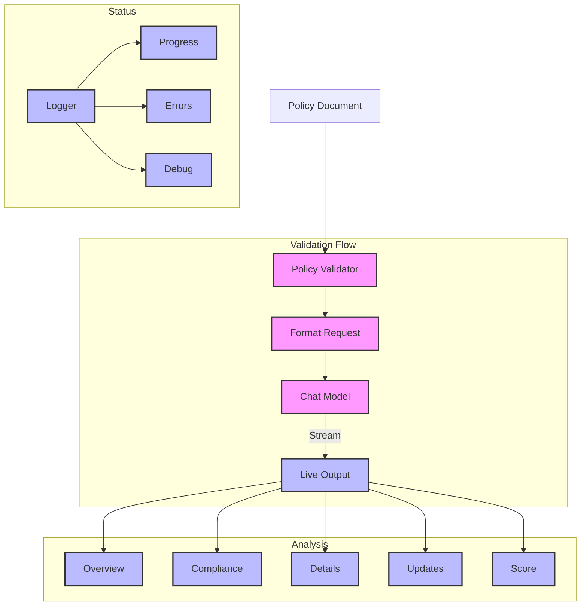

# Banking Policy Validator (120)

This example demonstrates a banking policy validation system using LangChain's chat models and streaming output. The system helps bank teams validate their policy documents with clear, structured feedback.

## Concepts Covered

This implementation showcases three key LangChain concepts:

1. Chat Models
   - Policy validation
   - Content analysis
   - Clear feedback
   - Structured output

2. Streaming Output
   - Live updates
   - Real-time display
   - Progress tracking
   - Clean format

3. Error Handling
   - Clear messages
   - Context tracking
   - Status updates
   - Recovery steps

## System Architecture Overview



## Expected Output

Running the example produces responses like:

```
Validating Security Policy
========================
Title: API Security Policy
Department: security
Type: security

Validation Report
================

1. Policy Overview
Structure:
- Well-organized with 6 main sections
- Clear hierarchy and formatting
- Logical flow of requirements

Content:
- Clear and specific requirements
- Technical details included
- Implementation guidance present

2. Compliance Check
Required Elements:
✓ Authentication mechanisms
✓ Authorization controls
✓ Data protection measures
✓ Security monitoring
✓ Compliance requirements

Missing Components:
- Version control details
- Policy review schedule
- Exception handling procedures

3. Detailed Analysis
Authentication:
+ Strong OAuth2.0 requirement
+ JWT implementation specified
- Key rotation period not defined

Authorization:
+ RBAC framework specified
+ Least privilege emphasized
- Role definitions incomplete

Data Protection:
+ TLS 1.3 requirement clear
+ Encryption standards defined
+ PII handling addressed

Monitoring:
+ Real-time detection required
+ Audit logging specified
- Alert thresholds missing

4. Recommendations
Critical Updates:
1. Add key rotation timeframes
2. Define role templates
3. Specify alert thresholds

Improvements:
- Include version control
- Add review schedule
- Document exceptions

5. Final Assessment
Score: 85/100
Status: PASS
Next Review: 6 months

Strong policy with good security foundations.
Minor updates needed for completeness.
```

## Code Breakdown

Key components include:

1. Validator Setup:
```python
llm = AzureChatOpenAI(
    deployment_name=os.getenv("AZURE_OPENAI_DEPLOYMENT_NAME"),
    temperature=0,
    streaming=True,
    callbacks=[StreamingStdOutCallbackHandler()]
)
```

2. Validation Prompt:
```python
prompt = ChatPromptTemplate.from_messages([
    ("system", """You are a banking policy validator.
Include in your analysis:
1. Policy Overview
2. Compliance Check
3. Detailed Analysis
4. Recommendations
5. Final Assessment

Format with clear sections and bullet points."""),
    ("human", "Review this policy:\n{content}")
])
```

3. Streaming Output:
```python
async def validate(self, policy: PolicyDocument) -> None:
    try:
        # Format request
        messages = self.prompt.format_messages(
            title=policy.title,
            department=policy.department.value,
            type=policy.type.value,
            content=policy.content
        )
        
        # Stream validation
        print("\nValidation Report")
        print("================\n")
        await self.llm.ainvoke(messages)
        
    except Exception as e:
        logger.error(f"❌ Validation failed: {str(e)}")
        raise
```

## API Reference

The example uses these LangChain components:

1. Chat Models:
   - [AzureChatOpenAI](https://api.python.langchain.com/en/latest/chat_models/langchain_openai.chat_models.AzureChatOpenAI.html)
   - Policy validation

2. Streaming:
   - [StreamingStdOutCallbackHandler](https://api.python.langchain.com/en/latest/callbacks/langchain.callbacks.streaming_stdout.StreamingStdOutCallbackHandler.html)
   - Live output

3. Message Templates:
   - [ChatPromptTemplate](https://api.python.langchain.com/en/latest/prompts/langchain_core.prompts.chat.ChatPromptTemplate.html)
   - Message formatting

## Dependencies

Required packages:
```
langchain==0.1.0
langchain-openai==0.0.5
pydantic>=2.0
python-dotenv>=1.0
```

## Best Practices

1. Prompting
   - Clear structure
   - Detailed sections
   - Example format
   - Simple guidance

2. Streaming
   - Live updates
   - Clean display
   - Progress show
   - Error handling

3. Validation
   - Clear feedback
   - Specific issues
   - Action items
   - Priority order

## Common Issues

1. Setup
   - Missing keys
   - Bad endpoint
   - Wrong access
   - Stream errors

2. Content
   - Bad format
   - Missing sections
   - Poor structure
   - Unclear content

3. Output
   - Stream breaks
   - Display issues
   - Format problems
   - Update fails