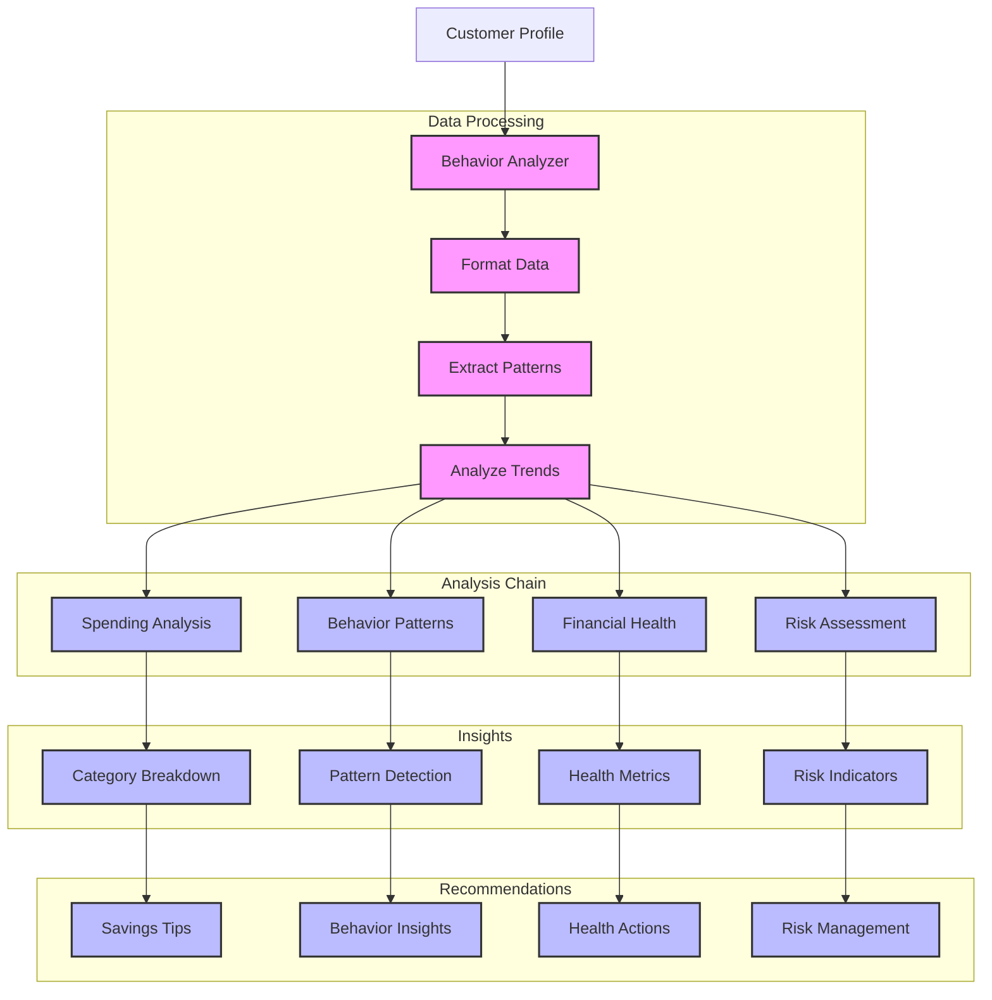

# Financial Behavior Analyzer (121)

This example demonstrates a financial behavior analysis system using LangChain's document processing and pattern analysis capabilities. The system helps data science teams understand and predict customer financial patterns with actionable insights.

## Concepts Covered

This implementation showcases three key LangChain concepts:

1. Document Processing
   - Transaction data
   - Customer profiles
   - Financial records
   - Pattern extraction

2. Pattern Analysis
   - Behavior detection
   - Trend analysis
   - Risk assessment
   - Prediction models

3. Report Generation
   - Clear insights
   - Structured output
   - Actionable recommendations
   - Visual feedback

## System Architecture Overview



## Expected Output

Running the example produces responses like:

```
Analyzing Financial Behavior
==========================
Customer ID: CUST001
Age Group: 25-34
Income Bracket: 75K-100K
Transactions: 7

Behavior Analysis:
=================

1. Spending Analysis
Category Breakdown:
- Savings: 22.2% ($1,000.00)
- Investment: 11.1% ($500.00)
- Retail: 2.0% ($89.99)
- Dining: 0.6% ($25.50)
- Entertainment: 1.0% ($45.00)
- Utilities: 3.3% ($150.00)

Frequency Patterns:
- Regular savings transfers
- Daily discretionary spending
- Investment activity present

2. Behavioral Patterns
Regular Behaviors:
+ Strong savings habit
+ Active investment participation
+ Moderate discretionary spending

Risk Indicators:
- No concerning patterns
- Spending within income
- Regular saving activity

3. Financial Health
Income Utilization:
- Monthly income: $4,500
- Savings rate: 33.3%
- Investment rate: 11.1%
- Essential expenses: 3.3%

Health Metrics:
✓ Strong savings behavior
✓ Investment mindset
✓ Controlled spending
✓ Good income management

4. Recommendations
Savings Opportunities:
1. Consider high-yield savings account
2. Explore automated saving rules
3. Set specific savings goals

Investment Options:
1. Review investment diversification
2. Consider retirement accounts
3. Explore index funds

Risk Management:
1. Build emergency fund
2. Review insurance coverage
3. Monitor credit score

Financial Goals:
1. Set retirement targets
2. Plan major purchases
3. Create wealth-building strategy
```

## Code Breakdown

Key components include:

1. Transaction Models:
```python
class Transaction(BaseModel):
    timestamp: str = Field(description="Transaction time")
    type: TransactionType = Field(description="Transaction type")
    category: TransactionCategory = Field(description="Category")
    amount: float = Field(description="Amount")
    merchant: str = Field(description="Merchant name")
    location: str = Field(description="Transaction location")
```

2. Analysis Chain:
```python
chain = (
    {"customer_id": RunnablePassthrough(), 
     "age_group": RunnablePassthrough(),
     "income_bracket": RunnablePassthrough(),
     "transactions": RunnablePassthrough()} 
    | analyzer_prompt 
    | llm 
    | StrOutputParser()
)
```

3. Behavior Analysis:
```python
async def analyze_behavior(self, profile: CustomerProfile) -> str:
    result = await self.chain.ainvoke({
        "customer_id": profile.customer_id,
        "age_group": profile.age_group,
        "income_bracket": profile.income_bracket,
        "transactions": self.format_transactions(profile.transactions)
    })
    return result
```

## API Reference

The example uses these LangChain components:

1. Chat Models:
   - [AzureChatOpenAI](https://api.python.langchain.com/en/latest/chat_models/langchain_openai.chat_models.AzureChatOpenAI.html)
   - Behavior analysis

2. Chain Components:
   - [RunnablePassthrough](https://api.python.langchain.com/en/latest/runnables/langchain_core.runnables.base.RunnablePassthrough.html)
   - Data handling

3. Output Parsing:
   - [StrOutputParser](https://api.python.langchain.com/en/latest/output_parsers/langchain_core.output_parsers.string.StrOutputParser.html)
   - Clean formatting

## Dependencies

Required packages:
```
langchain==0.1.0
langchain-openai==0.0.5
pydantic>=2.0
python-dotenv>=1.0
```

## Best Practices

1. Data Processing
   - Clean transactions
   - Proper formatting
   - Clear structure
   - Type validation

2. Pattern Analysis
   - Clear metrics
   - Good insights
   - Risk detection
   - Trend tracking

3. Report Generation
   - Clear sections
   - Key insights
   - Action items
   - Risk alerts

## Common Issues

1. Setup
   - Missing keys
   - Wrong endpoint
   - Access errors
   - Model issues

2. Data
   - Bad format
   - Missing fields
   - Invalid types
   - Poor structure

3. Analysis
   - Pattern errors
   - Missing trends
   - Bad insights
   - Wrong metrics