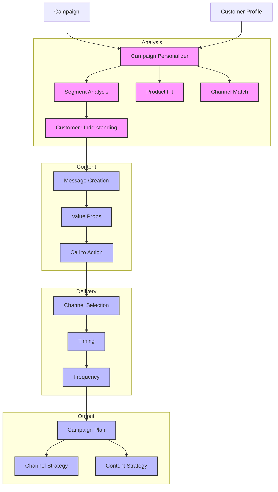

# Campaign Personalizer (122)

This example demonstrates a marketing campaign personalization system using LangChain's customer analysis and content generation capabilities. The system helps marketing teams create targeted financial product campaigns with personalized messaging and optimal delivery.

## Concepts Covered

This implementation showcases three key LangChain concepts:

1. Customer Analysis
   - Segment understanding
   - Preference tracking
   - Product history
   - Behavior patterns

2. Content Generation
   - Personalized messaging
   - Value propositions
   - Call to action
   - Channel optimization

3. Campaign Planning
   - Channel selection
   - Timing optimization
   - Frequency control
   - Response tracking

## System Architecture Overview



## Expected Output

Running the example produces responses like:

```
Personalizing Campaign
====================
Campaign: CAMP001
Product: investment
Customer: CUST001
Segment: young_professional

Personalized Campaign Plan:
=========================

1. Customer Understanding
Profile Analysis:
- Young professional with digital preference
- Active banking relationship (3 products)
- Tech-savvy investor persona
- Weekly engagement preferred

Product Fit:
✓ Smart Investment Account aligns with interests
✓ Mobile-first matches preferences
✓ Entry point suitable for segment

2. Campaign Fit
Value Match:
- Technology focus resonates
- Low entry barrier appealing
- Mobile access key feature
- Automated management valuable

Timing:
- Career growth stage
- Investment-ready profile
- Digital adoption phase

3. Content Personalization
Key Messages:
"Take control of your financial future with AI-powered investing"
- Emphasize tech-driven approach
- Highlight mobile capabilities
- Focus on convenience
- Stress low entry point

Unique Benefits:
1. "Invest smarter with AI"
2. "Bank-grade security"
3. "Start your wealth journey"

Call to Action:
"Open your Smart Account in 5 minutes"

4. Channel Strategy
Primary: Mobile App
- In-app banner
- Push notification
- Deep link to account opening

Backup: Email
- Follow-up details
- Product comparison
- FAQ section

Timing:
- Push: Tuesday 6pm
- In-app: All week
- Email: Wednesday morning

Frequency:
- Week 1: Daily in-app
- Week 2: 2x push
- Week 3: Email follow-up
```

## Code Breakdown

Key components include:

1. Profile Models:
```python
class CustomerProfile(BaseModel):
    customer_id: str
    segment: CustomerSegment
    products: List[ProductType]
    preferences: MarketingPreference
    metadata: Dict
```

2. Personalization Chain:
```python
chain = (
    {"campaign_id": RunnablePassthrough(), 
     "product": RunnablePassthrough(),
     "content": RunnablePassthrough(),
     "customer_id": RunnablePassthrough(),
     "segment": RunnablePassthrough(),
     "products": RunnablePassthrough(),
     "preferences": RunnablePassthrough()} 
    | personalizer_prompt 
    | llm 
    | StrOutputParser()
)
```

3. Campaign Processing:
```python
async def personalize_campaign(
    self, 
    campaign: Campaign, 
    customer: CustomerProfile
) -> str:
    result = await self.chain.ainvoke({
        "campaign_id": campaign.campaign_id,
        "product": campaign.product.value,
        "content": campaign.content,
        "customer_id": customer.customer_id,
        "segment": customer.segment.value,
        "products": customer.products,
        "preferences": customer.preferences
    })
    return result
```

## API Reference

The example uses these LangChain components:

1. Chat Models:
   - [AzureChatOpenAI](https://api.python.langchain.com/en/latest/chat_models/langchain_openai.chat_models.AzureChatOpenAI.html)
   - Content generation

2. Chain Components:
   - [RunnablePassthrough](https://api.python.langchain.com/en/latest/runnables/langchain_core.runnables.base.RunnablePassthrough.html)
   - Data handling

3. Output Parsing:
   - [StrOutputParser](https://api.python.langchain.com/en/latest/output_parsers/langchain_core.output_parsers.string.StrOutputParser.html)
   - Clean formatting

## Dependencies

Required packages:
```
langchain==0.1.0
langchain-openai==0.0.5
pydantic>=2.0
python-dotenv>=1.0
```

## Best Practices

1. Customer Analysis
   - Clear segments
   - Good profiling
   - Preference tracking
   - History analysis

2. Content Creation
   - Personal tone
   - Clear value
   - Strong CTA
   - Right format

3. Channel Strategy
   - Right timing
   - Good frequency
   - Clear tracking
   - Quick feedback

## Common Issues

1. Setup
   - Missing keys
   - Wrong endpoint
   - Bad access
   - Model issues

2. Profiling
   - Bad segments
   - Missing data
   - Wrong preferences
   - Poor history

3. Campaigns
   - Bad timing
   - Wrong channel
   - Poor content
   - Weak CTA