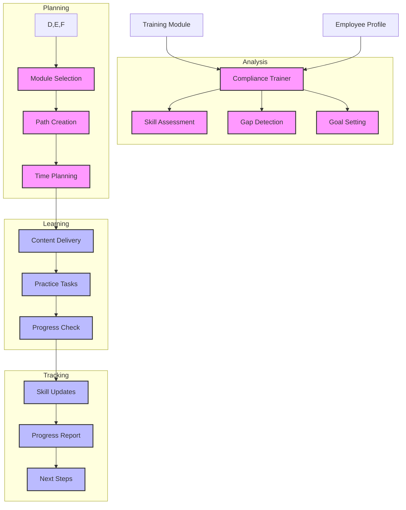

# Compliance Training Assistant (123)

This example demonstrates a banking compliance training system using LangChain's learning analysis and content adaptation capabilities. The system helps HR teams deliver personalized compliance training with skill tracking and progress monitoring.

## Concepts Covered

This implementation showcases three key LangChain concepts:

1. Learning Analysis
   - Skill assessment
   - Gap detection
   - Progress tracking
   - Goal setting

2. Content Adaptation
   - Personalized learning
   - Module selection
   - Path optimization
   - Level matching

3. Progress Tracking
   - Skill development
   - Milestone tracking
   - Success metrics
   - Review points

## System Architecture Overview



## Expected Output

Running the example produces responses like:

```
Creating Training Plan
====================
Module: Advanced Transaction Monitoring
Employee: EMP001
Department: risk_management
Role: Transaction Monitoring Analyst

Personalized Training Plan:
=========================

1. Skill Assessment
Current Level:
- AML Basics: Intermediate
- Transaction Monitoring: Intermediate
- Risk Assessment: Intermediate

Required Skills:
- Complex Transaction Analysis
- Advanced Alert Investigation
- ML Model Understanding
- Network Analysis

Identified Gaps:
- Advanced pattern recognition
- Machine learning concepts
- Network visualization
- Advanced risk scoring

2. Training Plan
Module Selection:
✓ AML-201 appropriate level
✓ Builds on existing knowledge
✓ Addresses identified gaps

Learning Path:
Week 1:
- Pattern Analysis (30 min)
- Alert Investigation (30 min)
- Practice Cases (30 min)

Week 2:
- Machine Learning (30 min)
- Network Analysis (30 min)
- Hands-on Practice (30 min)

3. Progress Tracking
Key Milestones:
1. Complete pattern analysis module
2. Pass investigation scenarios
3. Demonstrate ML understanding
4. Complete network analysis

Success Metrics:
- Pattern recognition accuracy
- Alert handling speed
- Case documentation quality
- Risk assessment accuracy

4. Learning Support
Focus Areas:
- Complex transaction patterns
- ML model interpretation
- Network visualization tools
- Risk scoring models

Practice Needs:
- Daily case reviews
- Weekly assessments
- Monthly evaluations
- Peer reviews

Resources:
- Online simulations
- Case study library
- Reference guides
- Expert support
```

## Code Breakdown

Key components include:

1. Training Models:
```python
class TrainingModule(BaseModel):
    module_id: str
    title: str
    area: ComplianceArea
    level: SkillLevel
    content: str
    duration: int

class EmployeeProfile(BaseModel):
    employee_id: str
    department: Department
    role: str
    areas: List[ComplianceArea]
    completed: List[str]
    skills: Dict[str, SkillLevel]
```

2. Training Chain:
```python
chain = (
    {"module_id": RunnablePassthrough(), 
     "title": RunnablePassthrough(),
     "area": RunnablePassthrough(),
     "level": RunnablePassthrough(),
     "employee_id": RunnablePassthrough(),
     "current_skills": RunnablePassthrough()} 
    | trainer_prompt 
    | llm 
    | StrOutputParser()
)
```

3. Plan Creation:
```python
async def create_training_plan(
    self, 
    module: TrainingModule, 
    employee: EmployeeProfile
) -> str:
    result = await self.chain.ainvoke({
        "module_id": module.module_id,
        "title": module.title,
        "area": module.area.value,
        "level": module.level.value,
        "employee_id": employee.employee_id,
        "current_skills": employee.skills
    })
    return result
```

## API Reference

The example uses these LangChain components:

1. Chat Models:
   - [AzureChatOpenAI](https://api.python.langchain.com/en/latest/chat_models/langchain_openai.chat_models.AzureChatOpenAI.html)
   - Training analysis

2. Chain Components:
   - [RunnablePassthrough](https://api.python.langchain.com/en/latest/runnables/langchain_core.runnables.base.RunnablePassthrough.html)
   - Data handling

3. Output Parsing:
   - [StrOutputParser](https://api.python.langchain.com/en/latest/output_parsers/langchain_core.output_parsers.string.StrOutputParser.html)
   - Clean formatting

## Dependencies

Required packages:
```
langchain==0.1.0
langchain-openai==0.0.5
pydantic>=2.0
python-dotenv>=1.0
```

## Best Practices

1. Learning Analysis
   - Clear assessment
   - Good tracking
   - Gap detection
   - Goal setting

2. Content Planning
   - Level matching
   - Path building
   - Time planning
   - Resource allocation

3. Progress Tracking
   - Regular checks
   - Clear metrics
   - Good feedback
   - Next steps

## Common Issues

1. Setup
   - Missing keys
   - Wrong endpoint
   - Bad access
   - Model issues

2. Training
   - Wrong level
   - Bad path
   - Poor timing
   - Resource gaps

3. Tracking
   - Missing data
   - Poor metrics
   - Bad feedback
   - Wrong goals