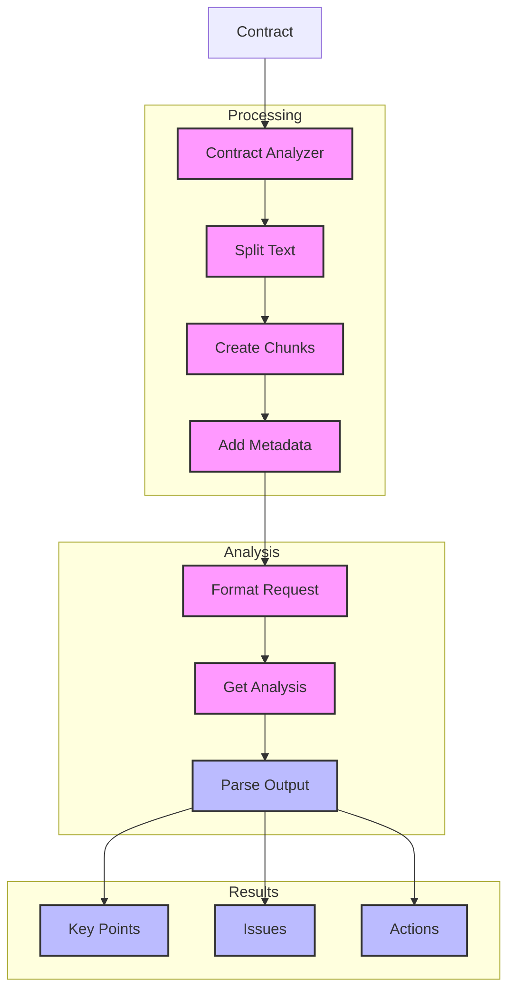

# Contract Analyzer (124)

This example demonstrates a legal document analysis system using LangChain's document processing and string output capabilities. The system helps legal teams analyze contracts with clear, structured results.

## Concepts Covered

This implementation showcases three key LangChain concepts:

1. Document Processing
   - Content extraction
   - Text splitting
   - Chunk management
   - Metadata handling

2. Text Splitting
   - Smart chunks
   - Size control
   - Context overlap
   - Clean breaks

3. String Output
   - Clear format
   - Simple parsing
   - Good structure
   - Easy debugging

## System Architecture Overview



## Expected Output

Running the example produces responses like:

```
Analyzing Contract
=================
Contract: LOAN-2025-001
Type: loan_agreement
Parties: Bank, Customer

Analysis Results:
================
CONTRACT ANALYSIS
---------------
Overview: Commercial loan agreement with standard terms and security provisions
Risk Level: MEDIUM

Issues Found:
1. Payment Schedule
   Risk: High
   Issue: Missing payment details
   Fix: Add specific amounts and dates
   Ref: REG-PAY-101

2. Insurance Coverage
   Risk: Medium
   Issue: Coverage terms undefined
   Fix: Specify required coverage
   Ref: REG-SEC-203

Key Clauses:
1. Loan Terms
   - $500,000 principal
   - 5.5% interest
   - 60-month term
   - Monthly payments

2. Security Package
   - Commercial property collateral
   - Insurance requirement
   - Annual valuation

Required Actions:
1. Complete payment schedule
2. Define insurance requirements
3. Add default cure periods
4. Specify covenant ratios

Next Review: 2025-06-01
```

## Code Breakdown

Key components include:

1. Text Splitting:
```python
splitter = RecursiveCharacterTextSplitter(
    chunk_size=2000,
    chunk_overlap=200,
    separators=["\n\n", "\n", ". ", " ", ""]
)

docs = splitter.create_documents(
    texts=[contract.content],
    metadatas=[{"contract_id": contract.contract_id}]
)
```

2. Analysis Format:
```python
prompt = ChatPromptTemplate.from_messages([
    ("system", """You are a legal document analyst.
Format your response exactly like this:

CONTRACT ANALYSIS
---------------
Overview: Summary
Risk Level: LEVEL
Issues Found: ..."""),
    ("human", "Review this contract:\n{content}")
])
```

3. Document Processing:
```python
async def analyze_contract(self, contract: Contract) -> str:
    # Split and process
    chunks = self.split_document(contract)
    
    # Get analysis
    messages = self.prompt.format_messages(
        contract_id=contract.contract_id,
        content=chunks[0].page_content
    )
    response = await self.llm.ainvoke(messages)
    return self.parser.parse(response.content)
```

## API Reference

The example uses these LangChain components:

1. Text Splitters:
   - [RecursiveCharacterTextSplitter](https://api.python.langchain.com/en/latest/text_splitters/langchain.text_splitter.RecursiveCharacterTextSplitter.html)
   - Smart chunking

2. Output Parsers:
   - [StrOutputParser](https://api.python.langchain.com/en/latest/output_parsers/langchain_core.output_parsers.string.StrOutputParser.html)
   - Text output

3. Document Base:
   - [Document](https://api.python.langchain.com/en/latest/documents/langchain_core.documents.base.Document.html)
   - Content handling

## Dependencies

Required packages:
```
langchain==0.1.0
langchain-openai==0.0.5
pydantic>=2.0
python-dotenv>=1.0
```

## Best Practices

1. Document Processing
   - Clean splits
   - Good chunks
   - Right size
   - Keep context

2. Text Analysis
   - Clear format
   - Good examples
   - Simple output
   - Easy parsing

3. Error Handling
   - Clean errors
   - Good logging
   - Easy debug
   - Fast fixes

## Common Issues

1. Setup
   - Missing keys
   - Wrong endpoint
   - Bad access
   - Model errors

2. Processing
   - Bad splits
   - Lost context
   - Wrong size
   - Poor chunks

3. Output
   - Wrong format
   - Missing parts
   - Bad structure
   - Parse errors