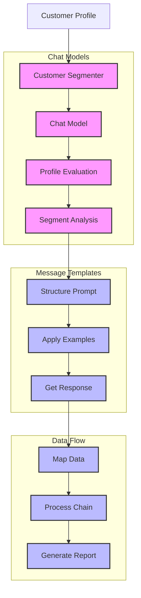

# Customer Segmenter (125)

This example demonstrates banking customer analysis using LangChain's chat models, message templates, and data flow capabilities. The system helps marketing teams understand and target customer segments with personalized strategies.

## Concepts Covered

This implementation showcases three key LangChain concepts:

1. Chat Models
   - Profile evaluation
   - Segment analysis
   - Personalization
   - Value scoring

2. Message Templates
   - Prompt structure
   - Example formatting
   - Response guidance
   - Clear output

3. RunnablePassthrough
   - Data mapping
   - Flow control
   - Input handling
   - Chain organization

## System Architecture Overview



## Expected Output

Running the example produces responses like:

```
Analyzing Customer
=================
Customer: CUST001
Age: 32
Income: $95,000.00
Products: 4
Digital: Yes

Segmentation Results:
====================
Segment: affluent_professional
Description: Tech-savvy young professional with high engagement
Value Score: 85/100

Best Channels:
- mobile_app
- email
- website

Recommended Products:
- investment
- credit_card
- mortgage
```

## Code Breakdown

Key components include:

1. Chat Model Setup:
```python
llm = AzureChatOpenAI(
    deployment_name=os.getenv("AZURE_OPENAI_DEPLOYMENT_NAME"),
    temperature=0
)
```

2. Message Template:
```python
prompt = ChatPromptTemplate.from_messages([
    ("system", """You are a customer segmentation analyst.
Return a JSON object like this example:
{example_format}"""),
    ("human", "Analyze this customer:\n{data}")
])
```

3. Data Flow:
```python
async def analyze_customer(
    self, 
    profile: CustomerProfile
) -> SegmentReport:
    # Map and process data
    messages = self.prompt.format_messages(
        customer_id=profile.customer_id,
        age=profile.age,
        income=profile.income
    )
    response = await self.llm.ainvoke(messages)
    return SegmentReport(**json.loads(response.content))
```

## API Reference

The example uses these LangChain components:

1. Chat Models:
   - [AzureChatOpenAI](https://api.python.langchain.com/en/latest/chat_models/langchain_openai.chat_models.AzureChatOpenAI.html)
   - Profile evaluation

2. Message Templates:
   - [ChatPromptTemplate](https://api.python.langchain.com/en/latest/prompts/langchain_core.prompts.chat.ChatPromptTemplate.html)
   - Prompt formatting

3. Chain Components:
   - [RunnablePassthrough](https://api.python.langchain.com/en/latest/runnables/langchain_core.runnables.base.RunnablePassthrough.html)
   - Data flow

## Dependencies

Required packages:
```
langchain==0.1.0
langchain-openai==0.0.5
pydantic>=2.0
python-dotenv>=1.0
```

## Best Practices

1. Chat Models
   - Clear prompts
   - Good examples
   - Temperature 0
   - Error handling

2. Message Templates
   - Clear structure
   - Format guidance
   - Good examples
   - Clean output

3. Data Flow
   - Clean mapping
   - Good control
   - Error checks
   - Clear chain

## Common Issues

1. Setup
   - Missing keys
   - Wrong endpoint
   - Bad access
   - Model errors

2. Templates
   - Bad format
   - Wrong examples
   - Poor guidance
   - Missing parts

3. Flow Control
   - Data errors
   - Chain breaks
   - Lost context
   - Bad mapping
