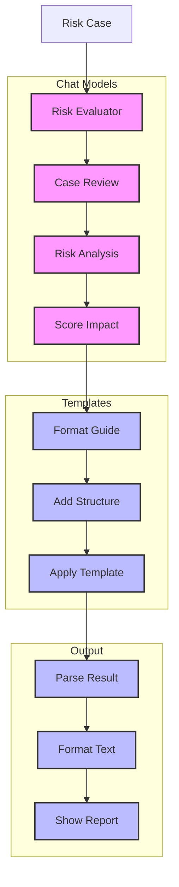

# Risk Evaluator (126)

This example demonstrates banking risk evaluation using LangChain's chat models, prompt templates, and output parsing capabilities. The system helps risk teams evaluate banking operations with structured results.

## Concepts Covered

This implementation showcases three key LangChain concepts:

1. Chat Models
   - Case analysis
   - Risk scoring
   - Impact assessment
   - Finding patterns

2. Prompt Templates
   - Evaluation format
   - Clear structure
   - Good examples
   - Response guide

3. Output Parsing
   - Structured results
   - Clean format
   - Clear sections
   - Easy reading

## System Architecture Overview



## Expected Output

Running the example produces responses like:

```
Evaluating Risk Case
===================
Case: RISK-2025-001
Type: credit_risk

Risk Assessment:
===============
RISK EVALUATION
-------------
Overall Risk: HIGH
Risk Score: 75/100

Analysis:
Startup with significant operational risks.
High burn rate and limited history are key concerns.

Risk Factors:
1. Operating History
   Level: HIGH
   Impact: Limited track record
   Action: Enhanced monitoring required

2. Cash Management
   Level: HIGH
   Impact: High burn rate vs reserves
   Action: Implement cash controls

3. Asset Coverage
   Level: MEDIUM
   Impact: Limited hard assets
   Action: Additional security needed

Required Steps:
1. Weekly cash monitoring
2. Monthly covenant checks
3. Quarterly asset review
```

## Code Breakdown

Key components include:

1. Chat Model Setup:
```python
llm = AzureChatOpenAI(
    deployment_name=os.getenv("AZURE_OPENAI_DEPLOYMENT_NAME"),
    temperature=0
)
```

2. Prompt Template:
```python
prompt = ChatPromptTemplate.from_messages([
    ("system", """You are a banking risk analyst.
Format your response exactly like this:

RISK EVALUATION
-------------
Overall Risk: LEVEL
Risk Score: XX/100"""),
    ("human", "Evaluate this case:\n{details}")
])
```

3. Output Parsing:
```python
parser = StrOutputParser()

async def evaluate_case(self, case: RiskCase) -> str:
    response = await self.llm.ainvoke(messages)
    return self.parser.parse(response.content)
```

## API Reference

The example uses these LangChain components:

1. Chat Models:
   - [AzureChatOpenAI](https://api.python.langchain.com/en/latest/chat_models/langchain_openai.chat_models.AzureChatOpenAI.html)
   - Risk analysis

2. Prompt Templates:
   - [ChatPromptTemplate](https://api.python.langchain.com/en/latest/prompts/langchain_core.prompts.chat.ChatPromptTemplate.html)
   - Format control

3. Output Parsing:
   - [StrOutputParser](https://api.python.langchain.com/en/latest/output_parsers/langchain_core.output_parsers.string.StrOutputParser.html)
   - Text formatting

## Dependencies

Required packages:
```
langchain==0.1.0
langchain-openai==0.0.5
pydantic>=2.0
python-dotenv>=1.0
```

## Best Practices

1. Chat Models
   - Clear prompts
   - Zero temperature
   - Good context
   - Error handling

2. Prompt Templates
   - Clear structure
   - Good examples
   - Format guide
   - Clean layout

3. Output Parsing
   - Simple format
   - Clear sections
   - Good spacing
   - Easy reading

## Common Issues

1. Setup
   - Missing keys
   - Wrong endpoint
   - Bad access
   - Model errors

2. Templates
   - Bad format
   - Wrong structure
   - Poor examples
   - Missing parts

3. Output
   - Wrong format
   - Bad sections
   - Poor spacing
   - Lost structure