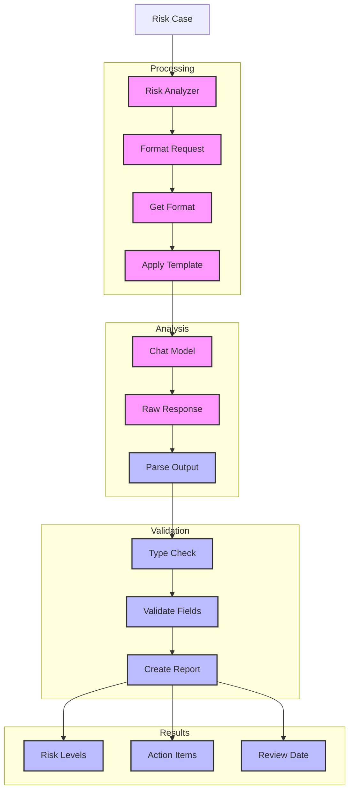

# Banking Risk Tool (127)

This example demonstrates a risk assessment system using LangChain's structured output parsing and response formatting capabilities. The system helps risk teams evaluate banking operations with reliable results and clear error handling.

## Concepts Covered

This implementation showcases three key LangChain concepts:

1. Structured Output
   - Pydantic parsing
   - Type validation
   - Model handling
   - Format control

2. Response Formatting
   - Output templates
   - Format guidance
   - Clear structure
   - Type hints

3. Error Handling
   - Parse recovery
   - Type checking
   - Status tracking
   - Clear errors

## System Architecture Overview



## Expected Output

Running the example produces responses like:

```
Analyzing Risk Case
=================
Case: RISK-2025-001
Summary: Small business loan default risk

Risk Assessment:
===============
Overview: Tech startup seeking growth capital with significant risk factors
Overall Risk: HIGH

Risk Factors:

1. Operating History
   ❗ Level: high
   Details: Limited 2-year track record
   Actions:
   - Review complete financial history
   - Analyze growth trajectory
   - Verify customer contracts

2. Cash Flow
   ❗ Level: high
   Details: High burn rate vs revenue
   Actions:
   - Monitor monthly burn rate
   - Set cash reserve requirements
   - Review expansion timeline

3. Market Position
   ⚠️ Level: medium
   Details: Strong growth but high competition
   Actions:
   - Analyze market share
   - Review competitive position
   - Assess growth sustainability

Next Steps:
1. Complete detailed financial review
2. Set milestone-based disbursement
3. Establish monitoring framework
4. Update loan covenants

Next Review: 2025-05-01
```

## Code Breakdown

Key components include:

1. Pydantic Models:
```python
class RiskFactor(BaseModel):
    name: str = Field(description="Factor name")
    level: RiskLevel = Field(description="Risk level")
    details: str = Field(description="Risk details")
    actions: List[str] = Field(description="Required actions")

class RiskReport(BaseModel):
    case_id: str
    overview: str
    factors: List[RiskFactor]
    overall_risk: RiskLevel
    next_steps: List[str]
    review_date: str
```

2. Parser Setup:
```python
parser = PydanticOutputParser(pydantic_object=RiskReport)
format_instructions = parser.get_format_instructions()

prompt = ChatPromptTemplate.from_messages([
    ("system", """You are a banking risk analyst.
Format as Pydantic JSON with proper types.

Instructions:
{format_instructions}"""),
    ("human", "Analyze this case:\n{details}")
])
```

3. Analysis Flow:
```python
async def analyze_case(self, case: RiskCase) -> RiskReport:
    # Format with instructions
    messages = self.prompt.format(
        format_instructions=self.parser.get_format_instructions(),
        case_id=case.case_id,
        details=case.details
    )
    
    # Get and parse response
    response = await self.llm.ainvoke(messages)
    result = self.parser.parse(response.content)
    return result
```

## API Reference

The example uses these LangChain components:

1. Output Parsers:
   - [PydanticOutputParser](https://api.python.langchain.com/en/latest/output_parsers/langchain.output_parsers.pydantic.PydanticOutputParser.html)
   - Structured output

2. Chat Models:
   - [AzureChatOpenAI](https://api.python.langchain.com/en/latest/chat_models/langchain_openai.chat_models.AzureChatOpenAI.html)
   - Risk analysis

3. Message Templates:
   - [ChatPromptTemplate](https://api.python.langchain.com/en/latest/prompts/langchain_core.prompts.chat.ChatPromptTemplate.html)
   - Format control

## Dependencies

Required packages:
```
langchain==0.1.0
langchain-openai==0.0.5
pydantic>=2.0
python-dotenv>=1.0
```

## Best Practices

1. Output Parsing
   - Clear models
   - Good validation
   - Type safety
   - Format guide

2. Response Format
   - Clear structure
   - Type hints
   - Field docs
   - Examples

3. Error Handling
   - Parse checks
   - Type validation
   - Clear errors
   - Recovery steps

## Common Issues

1. Setup
   - Missing keys
   - Wrong endpoint
   - Bad access
   - Model errors

2. Parsing
   - Wrong types
   - Missing fields
   - Bad format
   - JSON errors

3. Results
   - Invalid data
   - Type mismatch
   - Field errors
   - Format issues