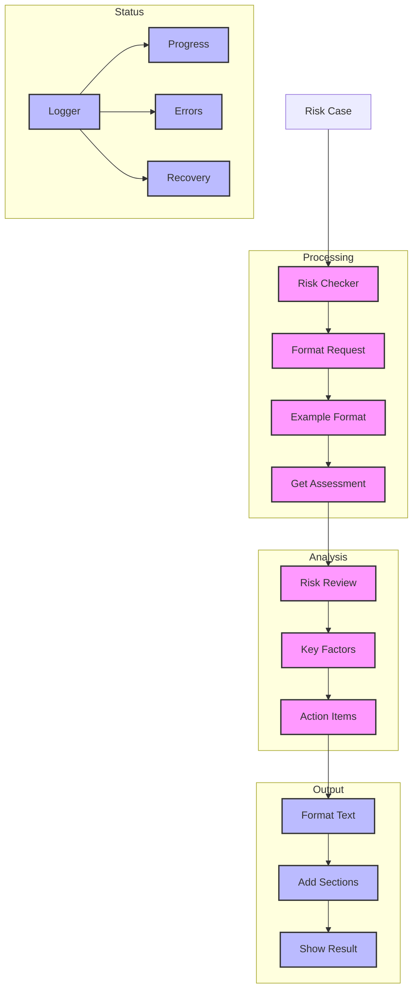

# Banking Risk Checker (128)

This example demonstrates a risk assessment system using LangChain's string output parsing and message control capabilities. The system helps risk teams evaluate banking operations with reliable results and easy recovery.

## Concepts Covered

This implementation showcases three key LangChain concepts:

1. String Output
   - Simple parsing
   - Clear format
   - Easy validation
   - Quick recovery

2. Message Control
   - Clear prompts
   - Good examples
   - Format guidance
   - Clean structure

3. Error Recovery
   - Step handling
   - Status tracking
   - Clear errors
   - Easy fixes

## System Architecture Overview



## Expected Output

Running the example produces responses like:

```
Processing Risk Case
===================
Case: RISK-2025-001
Title: Startup Credit Line Increase

Assessment Results:
==================
RISK ASSESSMENT
--------------
Overall Risk: HIGH

Key Factors:
1. Credit Utilization
   Level: High
   Issue: 85% utilization of current line
   Action: Review cash flow management

2. Growth Rate
   Level: High
   Issue: 40% YoY with high burn
   Action: Monitor growth sustainability

3. Cash Management
   Level: Critical
   Issue: Monthly burn near cash reserves
   Action: Implement cash controls

4. Market Position
   Level: Medium
   Issue: Limited market share (5%)
   Action: Assess competitive strength

Required Steps:
1. Complete cash flow analysis
2. Review growth projections
3. Set utilization limits
4. Establish monitoring framework
5. Structure staged increase

Next Review: 2025-05-01
```

## Code Breakdown

Key components include:

1. Output Parser:
```python
# Simple string parser
parser = StrOutputParser()

# Clear example format
TEMPLATE = """RISK ASSESSMENT
--------------
Overall Risk: {level}

Key Factors:
1. {factor_name}
   Level: {risk_level}
   Issue: {description}
   Action: {action}"""
```

2. Analysis Prompt:
```python
prompt = ChatPromptTemplate.from_messages([
    ("system", """You are a banking risk analyst.
Format your response exactly like this example:
{template}"""),
    ("human", """Analyze this case:
ID: {case_id}
Title: {title}
Details: {details}""")
])
```

3. Case Processing:
```python
async def check_case(self, case: RiskCase) -> str:
    try:
        # Get assessment
        messages = self.prompt.format_messages(
            case_id=case.case_id,
            title=case.title,
            details=case.details
        )
        response = await self.llm.ainvoke(messages)
        return self.parser.parse(response.content)
        
    except Exception as e:
        logger.error(f"Assessment failed: {str(e)}")
        raise
```

## API Reference

The example uses these LangChain components:

1. Output Parsers:
   - [StrOutputParser](https://api.python.langchain.com/en/latest/output_parsers/langchain_core.output_parsers.string.StrOutputParser.html)
   - Text output

2. Chat Models:
   - [AzureChatOpenAI](https://api.python.langchain.com/en/latest/chat_models/langchain_openai.chat_models.AzureChatOpenAI.html)
   - Risk analysis

3. Message Templates:
   - [ChatPromptTemplate](https://api.python.langchain.com/en/latest/prompts/langchain_core.prompts.chat.ChatPromptTemplate.html)
   - Format control

## Dependencies

Required packages:
```
langchain==0.1.0
langchain-openai==0.0.5
pydantic>=2.0
python-dotenv>=1.0
```

## Best Practices

1. String Output
   - Clear format
   - Good examples
   - Simple parsing
   - Easy fixes

2. Message Control
   - Clean prompts
   - Format guide
   - Good structure
   - Error checks

3. Error Recovery
   - Quick fixes
   - Clear status
   - Good logging
   - Easy debug

## Common Issues

1. Setup
   - Missing keys
   - Wrong endpoint
   - Bad access
   - Model errors

2. Format
   - Wrong structure
   - Missing sections
   - Bad layout
   - Poor spacing

3. Recovery
   - Parse errors
   - Bad format
   - Wrong output
   - Missing parts