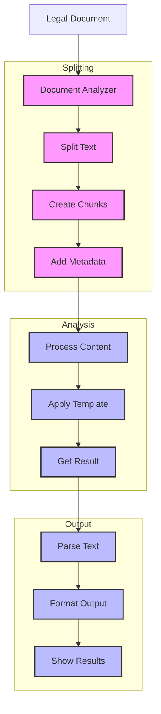

# Legal Analyzer (129)

This example demonstrates legal document analysis using LangChain's text splitting, chat models, and string output capabilities. The system helps legal teams analyze contracts and agreements with structured results.

## Concepts Covered

This implementation showcases three key LangChain concepts:

1. Text Splitting
   - Document segmentation
   - Content chunking
   - Smart breaks
   - Metadata handling

2. Chat Models
   - Content analysis
   - Risk evaluation
   - Issue detection
   - Action planning

3. String Output
   - Structured results
   - Clear sections
   - Simple format
   - Easy validation

## System Architecture Overview



## Expected Output

Running the example produces responses like:

```
Analyzing Document
=================
Document: LOAN-2025-001
Title: Commercial Loan Agreement
Type: loan_agreement

Analysis Results:
================
DOCUMENT ANALYSIS
---------------
Overview: Commercial loan agreement with standard terms
Risk Level: MEDIUM

Key Issues:
1. Payment Terms
   Risk: HIGH
   Issue: Schedule lacks detail
   Fix: Add specific dates and amounts
   Ref: REG-PAY-101

2. Insurance
   Risk: MEDIUM
   Issue: Coverage undefined
   Fix: Specify requirements
   Ref: REG-SEC-201

Important Sections:
1. Loan Structure
   - $500,000 principal
   - 5.5% annual interest
   - 60-month term

2. Security Package
   - Commercial property
   - Required insurance
   - Annual valuation

Required Actions:
1. Complete payment schedule
2. Define insurance terms
3. Add default periods

Next Review: 2025-06-01
```

## Code Breakdown

Key components include:

1. Text Splitting:
```python
splitter = RecursiveCharacterTextSplitter(
    chunk_size=2000,
    chunk_overlap=200,
    separators=["\n\n", "\n", ". ", " ", ""]
)

chunks = splitter.create_documents(
    texts=[doc.content],
    metadatas=[{"doc_id": doc.doc_id}]
)
```

2. Analysis Template:
```python
template = ChatPromptTemplate.from_messages([
    ("system", """You are a legal document analyst.
Format your response exactly like this:

DOCUMENT ANALYSIS
---------------
Overview: Summary
Risk Level: LEVEL"""),
    ("human", "Review this document:\n{content}")
])
```

3. Document Analysis:
```python
async def analyze_document(self, doc: LegalDocument) -> str:
    # Process content
    chunks = self.process_content(doc)
    
    # Get analysis
    messages = self.template.format_messages(
        doc_id=doc.doc_id,
        content=chunks[0].page_content
    )
    response = await self.llm.ainvoke(messages)
    return self.parser.parse(response.content)
```

## API Reference

The example uses these LangChain components:

1. Text Splitters:
   - [RecursiveCharacterTextSplitter](https://api.python.langchain.com/en/latest/text_splitters/langchain.text_splitter.RecursiveCharacterTextSplitter.html)
   - Smart splitting

2. Chat Models:
   - [AzureChatOpenAI](https://api.python.langchain.com/en/latest/chat_models/langchain_openai.chat_models.AzureChatOpenAI.html)
   - Content analysis

3. Output Parsers:
   - [StrOutputParser](https://api.python.langchain.com/en/latest/output_parsers/langchain_core.output_parsers.string.StrOutputParser.html)
   - Text formatting

## Dependencies

Required packages:
```
langchain==0.1.0
langchain-openai==0.0.5
pydantic>=2.0
python-dotenv>=1.0
```

## Best Practices

1. Text Splitting
   - Right chunk size
   - Good overlap
   - Clean breaks
   - Keep context

2. Chat Models
   - Clear prompts
   - Good examples
   - Zero temperature
   - Error checks

3. String Output
   - Simple format
   - Clear sections
   - Good structure
   - Easy reading

## Common Issues

1. Setup
   - Missing keys
   - Wrong endpoint
   - Bad access
   - Model errors

2. Splitting
   - Wrong size
   - Bad chunks
   - Lost context
   - Poor breaks

3. Output
   - Bad format
   - Missing parts
   - Poor spacing
   - Wrong structure