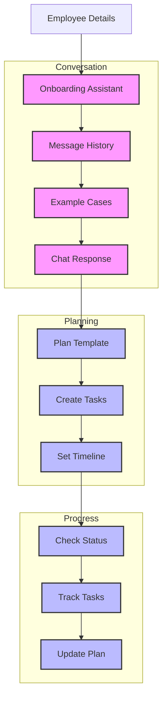

# Employee Onboarding Assistant (130)

This example demonstrates HR onboarding automation using LangChain's message history, few-shot learning, and chain template capabilities. The system helps HR teams streamline employee onboarding in banking environments.

## Concepts Covered

This implementation showcases three key LangChain concepts:

1. Message History
   - Contextual conversations
   - Previous interactions
   - Chat memory
   - Response tracking

2. Few Shot Learning
   - Example responses
   - Pattern matching
   - Style guidance
   - Format control

3. Chain Templates
   - Workflow structure
   - Message formatting 
   - Process control
   - Output handling

## System Architecture Overview



## Expected Output

Running the example produces responses like:

```
Creating Onboarding Plan
=======================
Employee: John Smith
Department: corporate_banking
Role: analyst
Start Date: 2025-04-15

Onboarding Plan:
===============
ONBOARDING PLAN
--------------
Employee: John Smith
Department: Corporate Banking
Role: Analyst

Required Tasks:
1. System Setup
   Due: Day 1
   Details: Access and credentials setup

2. Compliance Training
   Due: Week 1
   Details: Banking regulations review

3. Department Integration
   Due: Week 2
   Details: Team processes and tools

Progress Review:
===============
PROGRESS REVIEW
-------------
Completion: 50%

Completed Tasks:
1. IT Setup
   Done: 2025-04-15
   Status: Complete

2. Policy Review
   Done: 2025-04-16
   Status: Complete

Pending Tasks:
1. Department Training
   Due: 2025-04-18
   Action: Schedule session

Question Handling:
=================
Q: What training do I need to complete?

A:
For your Corporate Banking Analyst role:

1. Required Courses:
   - Banking systems (Day 1)
   - Risk management (Week 1)
   - Compliance basics (Week 1)

2. Department Training:
   - Analysis tools (Week 2)
   - Team procedures (Week 2)
   - Client systems (Week 2)

Access all training through the Learning Portal.
```

## Code Breakdown

Key components include:

1. History Setup:
```python
chat_template = ChatPromptTemplate.from_messages([
    ("system", "You are an HR onboarding assistant..."),
    MessagesPlaceholder(variable_name="history"),
    ("human", "{input}")
])
```

2. Example Cases:
```python
examples = [
    [
        HumanMessage(content="Question"),
        AIMessage(content="Structured response")
    ]
]

messages = chat_template.format_messages(
    examples=examples,
    history=history,
    input=question
)
```

3. Process Templates:
```python
plan_template = """Create a personalized plan.
Format tasks like this:

ONBOARDING PLAN
--------------
Employee: {name}
Required Tasks:
1. Task name
   Due: Timeline
   Details: Description"""

messages = [HumanMessage(content=formatted)]
response = await llm.ainvoke(messages)
```

## API Reference

The example uses these LangChain components:

1. Message History:
   - [MessagesPlaceholder](https://api.python.langchain.com/en/latest/prompts/langchain_core.prompts.chat.MessagesPlaceholder.html)
   - Chat context

2. Few Shot Learning:
   - [ChatPromptTemplate](https://api.python.langchain.com/en/latest/prompts/langchain_core.prompts.chat.ChatPromptTemplate.html)
   - Example handling

3. Chain Templates:
   - [HumanMessage](https://api.python.langchain.com/en/latest/messages/langchain_core.messages.human.HumanMessage.html)
   - [AIMessage](https://api.python.langchain.com/en/latest/messages/langchain_core.messages.ai.AIMessage.html)
   - Message control

## Dependencies

Required packages:
```
langchain==0.1.0
langchain-openai==0.0.5
pydantic>=2.0
python-dotenv>=1.0
```

## Best Practices

1. Message History
   - Good context
   - Clean tracking
   - Clear flow
   - Memory handling

2. Few Shot Learning
   - Clear examples
   - Good patterns
   - Right format
   - Style guides

3. Chain Templates
   - Clean structure
   - Good formats
   - Error handling
   - Flow control

## Common Issues

1. Setup
   - Missing keys
   - Wrong endpoint
   - Bad access
   - Model errors

2. History
   - Lost context
   - Bad tracking
   - Memory issues
   - Flow breaks

3. Templates
   - Bad format
   - Wrong structure
   - Missing parts
   - Parse errors