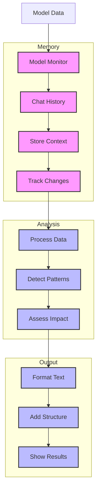

# Model Monitor (131)

This example demonstrates AI model monitoring using LangChain's memory, chat models, and string output capabilities. The system helps data science teams monitor and analyze AI model performance in banking applications.

## Concepts Covered

This implementation showcases three key LangChain concepts:

1. Memory
   - Chat history tracking
   - Context building
   - Pattern analysis
   - Trend detection

2. Chat Models
   - Pattern detection
   - Metric analysis
   - Impact assessment
   - Action planning

3. String Output
   - Clear formatting
   - Simple structure
   - Easy reading
   - Clean sections

## System Architecture Overview



## Expected Output

Running the example produces responses like:

```
Analyzing Model
==============
Model: FRAUD-2025-001
Type: fraud_detection

Current Metrics:
accuracy: 0.9856
precision: 0.9823
recall: 0.9789
f1_score: 0.9806
roc_auc: 0.9912
false_positives: 0.0177

Analysis Results:
================
MODEL ANALYSIS
-------------
Status: Performance Degradation
Risk Level: MEDIUM

Metric Changes:
1. Accuracy
   Value: 0.9856
   Change: -0.0045
   Impact: Slight decline in detection
   Action: Review recent cases

2. False Positives
   Value: 0.0177
   Change: +0.0044
   Impact: Increased false alerts
   Action: Adjust thresholds

Required Actions:
1. Review detection patterns
2. Update alert thresholds
3. Schedule model retraining

Next Review: 2025-04-10
```

## Code Breakdown

Key components include:

1. Memory Setup:
```python
from langchain_community.chat_message_histories import ChatMessageHistory

def __init__(self):
    self.memory = ChatMessageHistory()
    
def add_observation(self, observation: str) -> None:
    self.memory.add_user_message(observation)
```

2. Analysis Template:
```python
prompt = ChatPromptTemplate.from_messages([
    ("system", """Format response like this:
MODEL ANALYSIS
-------------
Status: Current state
Risk Level: HIGH/MEDIUM/LOW
...
"""),
    ("human", "Analyze this model:\n{data}")
])
```

3. String Output:
```python
parser = StrOutputParser()

async def analyze_model(self, model: ModelData) -> str:
    # Get and parse response
    response = await self.llm.ainvoke(messages)
    result = self.parser.parse(response.content)
    return result
```

## API Reference

The example uses these LangChain components:

1. Memory:
   - [ChatMessageHistory](https://api.python.langchain.com/en/latest/chat_message_histories/langchain_community.chat_message_histories.in_memory.ChatMessageHistory.html)
   - History tracking

2. Chat Models:
   - [AzureChatOpenAI](https://api.python.langchain.com/en/latest/chat_models/langchain_openai.chat_models.AzureChatOpenAI.html)
   - Pattern analysis

3. String Output:
   - [StrOutputParser](https://api.python.langchain.com/en/latest/output_parsers/langchain_core.output_parsers.string.StrOutputParser.html)
   - Text formatting

## Dependencies

Required packages:
```
langchain==0.1.0
langchain-openai==0.0.5
langchain-community>=0.0.10
python-dotenv>=1.0
```

## Best Practices

1. Memory
   - Clean history
   - Good tracking
   - Easy access
   - Context use

2. Chat Models
   - Clear prompts
   - Good examples
   - Zero temperature
   - Error handling

3. String Output
   - Clear sections
   - Simple format
   - Clean spacing
   - Easy reading

## Common Issues

1. Setup
   - Missing keys
   - Wrong endpoint
   - Bad access
   - Model errors

2. Memory
   - Lost context
   - Bad tracking
   - History issues
   - Pattern miss

3. Output
   - Bad format
   - Wrong sections
   - Poor spacing
   - Mixed structure