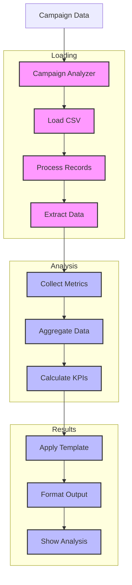

# Campaign Analyzer (132)

This example demonstrates marketing analytics using LangChain's document loading, aggregation, and prompt template capabilities. The system helps marketing teams optimize banking campaign performance.

## Concepts Covered

This implementation showcases three key LangChain concepts:

1. Document Loading
   - Data ingestion
   - CSV handling
   - Record processing
   - Content extraction

2. Aggregation
   - Metric collection
   - Data processing
   - Performance analysis
   - Result compilation

3. Prompt Templates
   - Analysis structure
   - Format control
   - Response guidance
   - Output clarity

## System Architecture Overview



## Expected Output

Running the example produces responses like:

```
Analyzing Campaign
=================
Campaign: CAMP-2025-001
Channel: email
Product: credit_card

Performance Metrics:
sent: 100,000
delivered: 98,500
opened: 35,460
clicked: 8,865
converted: 443
revenue: $221,500.00
cost: $15,000.00
roi: 1376.67%

Analysis Results:
================
CAMPAIGN ANALYSIS
---------------
Campaign: CAMP-2025-001
Channel: Email
Product: Credit Card

Performance Summary:
- Strong delivery rate (98.5%)
- Good open rate (36%)
- High ROI (1376.67%)
- Cost-effective channel

Target Analysis:
1. Young Professionals
   - High engagement rate
   - Good conversion
   - Strong potential

2. Digital First
   - Best performing segment
   - Quick response time
   - High click-through

Optimization Plan:
1. Segment Targeting
   Impact: +15% conversion
   Timeline: Next campaign

2. Content Personalization
   Impact: +25% engagement
   Timeline: 2 weeks

Next Steps:
1. Refine segmentation
2. A/B test messaging
3. Update targeting rules
```

## Code Breakdown

Key components include:

1. Document Loading:
```python
from langchain_community.document_loaders.csv_loader import CSVLoader

loader = CSVLoader(
    file_path=file_path,
    encoding='utf-8',
    csv_args={'delimiter': ','}
)
documents = loader.load()
```

2. Data Aggregation:
```python
def aggregate_metrics(self, data: List[Dict]) -> Dict[str, float]:
    metrics = {}
    for record in data:
        for key, value in record.items():
            if isinstance(value, (int, float)):
                metrics[key] = metrics.get(key, 0) + value
    return metrics
```

3. Template Usage:
```python
template = ChatPromptTemplate.from_messages([
    ("system", """Format like this:
CAMPAIGN ANALYSIS
---------------
Campaign: ID
Performance: Summary
Actions: Required steps"""),
    ("human", "Analyze: {data}")
])
```

## API Reference

The example uses these LangChain components:

1. Document Loaders:
   - [CSVLoader](https://api.python.langchain.com/en/latest/document_loaders/langchain_community.document_loaders.csv_loader.CSVLoader.html)
   - Data loading

2. Prompt Templates:
   - [ChatPromptTemplate](https://api.python.langchain.com/en/latest/prompts/langchain_core.prompts.chat.ChatPromptTemplate.html)
   - Format control

3. String Output:
   - [StrOutputParser](https://api.python.langchain.com/en/latest/output_parsers/langchain_core.output_parsers.string.StrOutputParser.html)
   - Text formatting

## Dependencies

Required packages:
```
langchain==0.1.0
langchain-openai==0.0.5
langchain-community>=0.0.10
python-dotenv>=1.0
```

## Best Practices

1. Document Loading
   - Clean data
   - Good encoding
   - Error checks
   - Content validation

2. Aggregation
   - Type safety
   - Error handling
   - Clean math
   - Good logging

3. Templates
   - Clear format
   - Good examples
   - Simple structure
   - Easy reading

## Common Issues

1. Setup
   - Missing keys
   - Wrong endpoint
   - Bad access
   - Model errors

2. Loading
   - Bad format
   - Wrong encoding
   - File errors
   - Data issues

3. Processing
   - Wrong types
   - Bad math
   - Missing data
   - Format errors