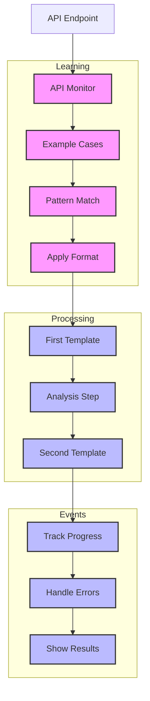

# API Monitor (133)

This example demonstrates API documentation using LangChain's few-shot learning, template chaining, and async callback capabilities. The system helps development teams monitor and optimize banking APIs.

## Concepts Covered

This implementation showcases three key LangChain concepts:

1. Few Shot Learning
   - Example analysis
   - Pattern matching
   - Style guidance
   - Response format

2. Template Chaining
   - Sequential steps
   - Process flow
   - Data passing
   - Result handling

3. Async Callbacks
   - Event handling
   - Process tracking
   - Error catching
   - Status updates

## System Architecture Overview



## Expected Output

Running the example produces responses like:

```
Analyzing Endpoint
=================
Endpoint: API-2025-001
Category: account_services
Path: GET /v1/accounts/{id}/balance

Performance Metrics:
requests: 15,000
errors: 450
latency_p95: 2.50s
latency_p50: 0.80s
success_rate: 97.0%
cpu_usage: 65.5%
memory_usage: 78.2%
cache_hits: 85.5%

Analysis Results:
================
API ANALYSIS
-----------
Status: WARN
Service: Account Services
Issue: Performance Degradation

Problem:
- High P95 latency (2.5s)
- Elevated error rate (3%)
- High resource usage

Impact:
- User experience affected
- Mobile app slowdown
- Transaction delays

Actions:
1. Scale resources
2. Optimize queries
3. Review caching

Priority: HIGH
Timeline: 12 hours

Recommendations:
OPTIMIZATION PLAN
---------------
Status: Needs Improvement
Priority: HIGH

Issues Found:
1. Resource Usage
   Impact: Service stability
   Fix: Scale up capacity
   Time: 2 hours

2. Cache Performance
   Impact: Response time
   Fix: Update cache rules
   Time: 4 hours

Required Actions:
1. Add server capacity
2. Optimize DB queries
3. Update cache config
4. Monitor metrics

Next Check: 2025-04-04
```

## Code Breakdown

Key components include:

1. Few Shot Setup:
```python
examples = [
    [
        HumanMessage(content="High latency issue"),
        AIMessage(content="""API ANALYSIS
-----------
Status: WARN
Service: Name
Issue: Details""")
    ]
]

messages = check.format_messages(
    examples=examples,
    endpoint_id=endpoint.endpoint_id
)
```

2. Template Chain:
```python
check = ChatPromptTemplate.from_messages([
    ("system", "First analysis step..."),
    ("human", "Analyze: {data}")
])

suggest = ChatPromptTemplate.from_messages([
    ("system", "Second analysis step..."),
    ("human", "Plan for: {analysis}")
])
```

3. Async Callbacks:
```python
class MonitorCallback(AsyncCallbackHandler):
    async def on_llm_start(self, *args, **kwargs):
        logger.info("Starting analysis")
        
    async def on_llm_end(self, *args, **kwargs):
        logger.info("Analysis complete")
```

## API Reference

The example uses these LangChain components:

1. Few Shot Learning:
   - [HumanMessage](https://api.python.langchain.com/en/latest/messages/langchain_core.messages.human.HumanMessage.html)
   - [AIMessage](https://api.python.langchain.com/en/latest/messages/langchain_core.messages.ai.AIMessage.html)
   - Example handling

2. Templates:
   - [ChatPromptTemplate](https://api.python.langchain.com/en/latest/prompts/langchain_core.prompts.chat.ChatPromptTemplate.html)
   - Format control

3. Callbacks:
   - [AsyncCallbackHandler](https://api.python.langchain.com/en/latest/callbacks/langchain_core.callbacks.async_callback.AsyncCallbackHandler.html)
   - Event management

## Dependencies

Required packages:
```
langchain==0.1.0
langchain-openai==0.0.5
pydantic>=2.0
python-dotenv>=1.0
```

## Best Practices

1. Few Shot Learning
   - Clear examples
   - Good patterns
   - Right format
   - Style guides

2. Template Chaining
   - Clean flow
   - Good data
   - Error checks
   - Clear steps

3. Async Events
   - Good tracking
   - Error handling
   - Clear status
   - Easy debug

## Common Issues

1. Setup
   - Missing keys
   - Wrong endpoint
   - Bad access
   - Model errors

2. Processing
   - Chain breaks
   - Data loss
   - Bad flow
   - Step fails

3. Events
   - Lost tracking
   - Bad errors
   - Status miss
   - Event skip