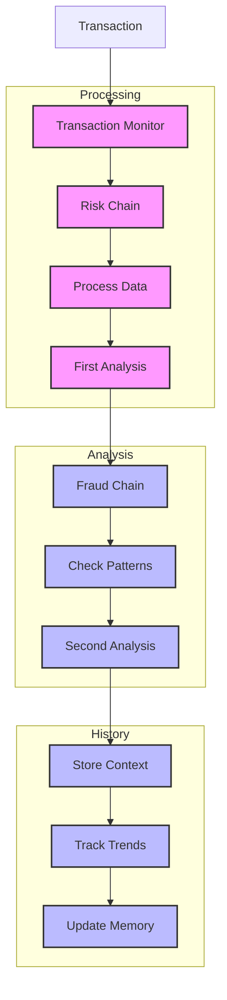

# Transaction Monitor (134)

This example demonstrates transaction monitoring using LangChain's sequential chains, output parsing, and chat history capabilities. The system helps compliance teams monitor and analyze banking transactions for risk and fraud.

## Concepts Covered

This implementation showcases three key LangChain concepts:

1. Sequential Chains
   - Multi-step analysis
   - Process flow
   - Result passing
   - Chain control

2. Output Parsing
   - Structured results
   - Format control
   - Clear output
   - Easy reading

3. Chat History
   - Context tracking
   - Pattern memory
   - Analysis history
   - Trend detection

## System Architecture Overview



## Expected Output

Running the example produces responses like:

```
Analyzing Transaction
===================
Transaction: TXN-2025-001
Type: wire_transfer
Amount: USD 50,000.00
Country: RO

Risk Metrics:
velocity: 3.50
frequency: 2.00
pattern_match: 0.85
location_risk: 0.65
amount_variance: 2.50
profile_match: 0.55

Analysis Results:
================
RISK ASSESSMENT
-------------
Transaction: TXN-2025-001
Type: Wire Transfer
Risk Level: HIGH

Risk Factors:
1. Location Risk
   Level: HIGH
   Reason: Unusual country for client
   Action: Enhanced due diligence

2. Amount Pattern
   Level: MEDIUM
   Reason: Above normal range
   Action: Review transaction history

Required Actions:
1. Verify source of funds
2. Check beneficiary details
3. Document justification

FRAUD ANALYSIS
------------
Status: ALERT
Level: HIGH

Patterns Found:
1. Unusual Location
   - First time country
   - High risk jurisdiction
   - Similar case patterns

2. Amount Anomaly
   - Outside profile range
   - Velocity increase
   - Pattern deviation

Required Actions:
1. Hold transaction
2. Contact client
3. File SAR report
```

## Code Breakdown

Key components include:

1. Chain Setup:
```python
risk = ChatPromptTemplate.from_messages([
    ("system", """Format like this:
RISK ASSESSMENT
-------------
Transaction: ID
Risk Level: HIGH/MEDIUM/LOW
...""")
])

fraud = ChatPromptTemplate.from_messages([
    ("system", """Format like this:
FRAUD ANALYSIS
------------
Status: ALERT/CLEAR
Level: HIGH/MEDIUM/LOW
...""")
])
```

2. History Tracking:
```python
memory = ChatMessageHistory()

def add_analysis(self, analysis: str) -> None:
    self.memory.add_user_message(analysis)

def get_history(self) -> List[str]:
    return [msg.content for msg in self.memory.messages[-5:]]
```

3. Analysis Flow:
```python
async def analyze_transaction(self, transaction: Transaction) -> str:
    # Get risk assessment
    risk_result = await self.llm.ainvoke(risk_messages)
    self.add_analysis(risk_result)
    
    # Get fraud analysis
    fraud_result = await self.llm.ainvoke(fraud_messages)
    return f"{risk_result}\n\n{fraud_result}"
```

## API Reference

The example uses these LangChain components:

1. Sequential Chains:
   - [ChatPromptTemplate](https://api.python.langchain.com/en/latest/prompts/langchain_core.prompts.chat.ChatPromptTemplate.html)
   - Process flow

2. Output Parsing:
   - [StrOutputParser](https://api.python.langchain.com/en/latest/output_parsers/langchain_core.output_parsers.string.StrOutputParser.html)
   - Text formatting

3. Chat History:
   - [ChatMessageHistory](https://api.python.langchain.com/en/latest/chat_message_histories/langchain_community.chat_message_histories.in_memory.ChatMessageHistory.html)
   - Memory tracking

## Dependencies

Required packages:
```
langchain==0.1.0
langchain-openai==0.0.5
langchain-community>=0.0.10
python-dotenv>=1.0
```

## Best Practices

1. Sequential Chains
   - Clean flow
   - Good passing
   - Error checks
   - Result handling

2. Output Parsing
   - Clear format
   - Simple structure
   - Good sections
   - Easy reading

3. Chat History
   - Context limit
   - Clean tracking
   - Good memory
   - Pattern focus

## Common Issues

1. Setup
   - Missing keys
   - Wrong endpoint
   - Bad access
   - Model errors

2. Processing
   - Chain breaks
   - Lost data
   - Bad flow
   - Step fails

3. History
   - Memory leak
   - Context loss
   - Pattern miss
   - Bad tracking