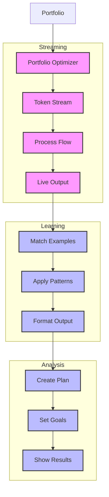

# Portfolio Optimizer (135)

This example demonstrates investment analysis using LangChain's streaming, few-shot learning, and prompt template capabilities. The system helps investment teams optimize client portfolios with real-time analysis.

## Concepts Covered

This implementation showcases three key LangChain concepts:

1. Streaming
   - Real-time analysis
   - Token flow
   - Progressive output
   - Direct feedback

2. Few Shot Learning
   - Strategy examples
   - Pattern matching
   - Style guidance
   - Format control

3. Prompt Templates
   - Analysis structure
   - Clear format
   - Response guidance
   - Output clarity

## System Architecture Overview



## Expected Output

Running the example produces responses like:

```
Analyzing Portfolio
==================
Portfolio: PORT-2025-001
Client: John Smith
Risk Level: aggressive

Current Allocation:
US_TECH: 35.0%
US_GROWTH: 25.0%
INTL_DEV: 15.0%
EMERG_MKT: 15.0%
CASH: 10.0%

Performance Metrics:
returns_1y: +18.5%
volatility: 15.22
sharpe: 1.05
beta: 1.25
alpha: +2.5%
max_drawdown: -12.5%

Analysis Results:
================
PORTFOLIO ANALYSIS
----------------
Client: John Smith
Risk Level: AGGRESSIVE
Style: Growth Focus

Current Mix:
- High tech exposure
- Strong growth tilt
- Good diversification
- Elevated volatility

Optimization Plan:
1. Sector Balance
   Current: Tech 35%
   Target: 25%
   Reason: Risk concentration

2. International Mix
   Current: 30% total
   Target: 35% total
   Reason: More diversification

Implementation:
1. Reduce US tech by 10%
2. Add international growth 5%
3. Rebalance emerging markets

Risk Management:
- Sector limits 30%
- Stop loss orders
- Monthly rebalancing

Monitor:
- Sector correlation
- Geographic exposure
- Volatility metrics
```

## Code Breakdown

Key components include:

1. Streaming Setup:
```python
llm = AzureChatOpenAI(
    temperature=0,
    streaming=True
)

async for chunk in self.llm.astream(messages):
    yield chunk.content
```

2. Example Format:
```python
examples = [
    [
        HumanMessage(content="Portfolio type"),
        AIMessage(content="""PORTFOLIO STRATEGY
-----------------
Risk Level: LEVEL
Style: Strategy
Asset Mix: Details""")
    ]
]
```

3. Template Usage:
```python
template = ChatPromptTemplate.from_messages([
    ("system", """Format response like this:
PORTFOLIO ANALYSIS
----------------
Client: Name
Risk Level: LEVEL
Style: Type"""),
    ("human", "Analyze: {portfolio}")
])
```

## API Reference

The example uses these LangChain components:

1. Streaming:
   - [astream](https://api.python.langchain.com/en/latest/chat_models/langchain_openai.chat_models.AzureChatOpenAI.html#langchain_openai.chat_models.AzureChatOpenAI.astream)
   - Real-time output

2. Few Shot Learning:
   - [HumanMessage](https://api.python.langchain.com/en/latest/messages/langchain_core.messages.human.HumanMessage.html)
   - [AIMessage](https://api.python.langchain.com/en/latest/messages/langchain_core.messages.ai.AIMessage.html)
   - Example based

3. Prompt Templates:
   - [ChatPromptTemplate](https://api.python.langchain.com/en/latest/prompts/langchain_core.prompts.chat.ChatPromptTemplate.html)
   - Format control

## Dependencies

Required packages:
```
langchain==0.1.0
langchain-openai==0.0.5
pydantic>=2.0
python-dotenv>=1.0
```

## Best Practices

1. Streaming
   - Fast feedback
   - Clean chunks
   - Good flow
   - Error handling

2. Few Shot Learning
   - Clear examples
   - Good patterns
   - Right format
   - Style guide

3. Templates
   - Clean structure
   - Good format
   - Simple layout
   - Easy reading

## Common Issues

1. Setup
   - Missing keys
   - Wrong endpoint
   - Bad access
   - Model errors

2. Streaming
   - Flow breaks
   - Token errors
   - Bad chunks
   - Lost data

3. Output
   - Wrong format
   - Bad examples
   - Poor structure
   - Style miss