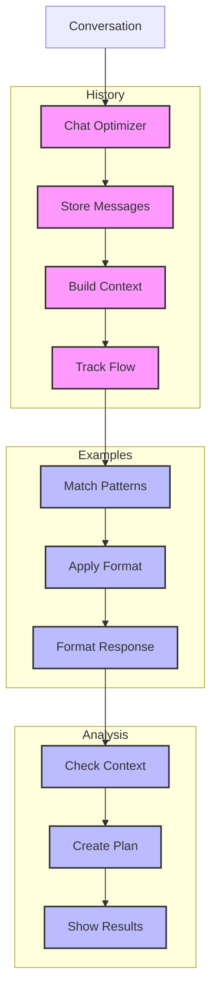

# Chatbot Optimizer (136)

This example demonstrates conversation analysis using LangChain's message history, few-shot learning, and prompt template capabilities. The system helps UX teams optimize banking chatbot interactions.

## Concepts Covered

This implementation showcases three key LangChain concepts:

1. Message History
   - Context tracking
   - Chat memory
   - Flow analysis
   - Pattern detection

2. Few Shot Learning
   - Example patterns
   - Style guidance
   - Response format
   - Case matching

3. Prompt Templates
   - Analysis structure
   - Format control
   - Clear outputs
   - Response guidance

## System Architecture Overview



## Expected Output

Running the example produces responses like:

```
Analyzing Conversation
====================
Session: CHAT-2025-001
Intent: money_transfer

Chat History:
User: I want to send money to my friend
Assistant: I'll help you with the transfer. Which account would you like to send from?
User: My checking account
Assistant: How much would you like to send?
User: $500
Assistant: Could you provide your friend's account details for the transfer?

Chat Metrics:
duration: 45.5s
turns: 6.0
satisfaction: 85.0%
completion: 100.0%
clarity: 95.0%
efficiency: 80.0%

Analysis Results:
================
CHAT ANALYSIS
------------
Session: CHAT-2025-001
Intent: Money Transfer
Mood: Neutral

Pattern Review:
- Step-by-step flow
- Security focused
- Clear guidance

Effectiveness:
1. Strong Points
   - Clear process
   - Safety checks
   - User guidance

2. Weak Points
   - Extra steps
   - Slow completion
   - Repetitive input

Optimization Plan:
1. Flow Efficiency
   Current: 6 turns
   Target: 4 turns
   Steps: Combine related questions

2. Response Speed
   Current: 45.5s
   Target: 30s
   Steps: Pre-fetch account data

Metrics to Track:
- Turn reduction
- Time to complete
- User satisfaction

Next Review: 2025-04-10
```

## Code Breakdown

Key components include:

1. History Setup:
```python
from langchain_community.chat_message_histories import ChatMessageHistory

memory = ChatMessageHistory()

def add_message(self, message: Dict) -> None:
    if message["role"] == "user":
        self.memory.add_user_message(message["content"])
    else:
        self.memory.add_ai_message(message["content"])
```

2. Example Patterns:
```python
examples = [
    {
        "input": "Question type",
        "output": """Pattern Structure:
- Key elements
- Clear format
- Good style"""
    }
]
```

3. Template Usage:
```python
template = ChatPromptTemplate.from_messages([
    ("system", """Format response like this:
CHAT ANALYSIS
------------
Session: ID
Pattern: Type"""),
    ("human", "Analyze: {chat}")
])
```

## API Reference

The example uses these LangChain components:

1. Message History:
   - [ChatMessageHistory](https://api.python.langchain.com/en/latest/chat_message_histories/langchain_community.chat_message_histories.in_memory.ChatMessageHistory.html)
   - History tracking

2. Messages:
   - [HumanMessage](https://api.python.langchain.com/en/latest/messages/langchain_core.messages.human.HumanMessage.html)
   - [AIMessage](https://api.python.langchain.com/en/latest/messages/langchain_core.messages.ai.AIMessage.html)
   - Pattern examples

3. Prompt Templates:
   - [ChatPromptTemplate](https://api.python.langchain.com/en/latest/prompts/langchain_core.prompts.chat.ChatPromptTemplate.html)
   - Format control

## Dependencies

Required packages:
```
langchain==0.1.0
langchain-openai==0.0.5
langchain-community>=0.0.10
python-dotenv>=1.0
```

## Best Practices

1. Message History
   - Clean tracking
   - Good context
   - Flow patterns
   - Memory limits

2. Few Shot Learning
   - Clear examples
   - Good patterns
   - Right format
   - Style guide

3. Templates
   - Clean structure
   - Good format
   - Simple layout
   - Easy reading

## Common Issues

1. Setup
   - Missing keys
   - Wrong endpoint
   - Bad access
   - Model errors

2. History
   - Lost context
   - Bad tracking
   - Memory issues
   - Flow breaks

3. Patterns
   - Wrong format
   - Bad examples 
   - Poor structure
   - Style miss