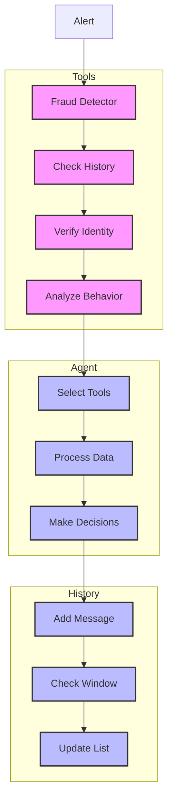

# Fraud Detector (137)

This example demonstrates fraud detection using LangChain's tool calling, agents, and message history capabilities. The system helps risk teams detect and investigate potential banking fraud.

## Concepts Covered

This implementation showcases three key LangChain concepts:

1. Tool Calling
   - External systems
   - Function integration
   - API access
   - Data retrieval

2. Agents
   - Autonomous investigation
   - Tool selection
   - Process flow
   - Decision making

3. Message History
   - Context tracking
   - Window limits
   - Pattern memory
   - History analysis

## System Architecture Overview



## Expected Output

Running the example produces responses like:

```
Investigating Alert
==================
Alert: ALERT-2025-001
Level: high_risk
Type: account_takeover
Source: behavior_monitor

Related Transaction:
ID: TXN-2025-001
Type: large_transfer
Amount: $25,000.00
Time: 2025-04-03T19:30:00Z

Investigation Results:
=====================
FRAUD ANALYSIS
-------------
Alert: ALERT-2025-001
Level: HIGH
Type: Account Takeover

Findings:
1. Transaction Pattern
   Evidence: 5 related transactions
   Impact: Suspicious pattern
   Risk: High

2. Identity Issues
   Evidence: Location mismatch
   Impact: Unauthorized access
   Risk: Critical

3. Behavior Anomalies
   Evidence: Amount and location
   Impact: Profile deviation
   Risk: High

Required Actions:
1. Block account
2. Freeze transaction
3. Contact customer

Next Steps:
1. Pattern review
2. Security audit
3. Profile update
```

## Code Breakdown

Key components include:

1. Tool Setup:
```python
from langchain_core.tools import Tool
from langchain_core.utils.function_calling import convert_to_openai_function

tools = [
    Tool(name="check_history",
         description="Check transactions",
         func=self.check_history)
]

functions = [convert_to_openai_function(t) for t in tools]
```

2. Agent Creation:
```python
prompt = ChatPromptTemplate.from_messages([
    ("system", """Format like this:
FRAUD ANALYSIS
-------------
Alert: ID
Level: SEVERITY"""),
    ("human", "{input}"),
    MessagesPlaceholder(variable_name="agent_scratchpad")
])

agent = create_openai_tools_agent(llm, tools, prompt)
```

3. History Management:
```python
# Setup memory
self.messages = []
self.window_size = 5

# Update memory
self.messages.append({
    "role": "user",
    "content": input_text
})
if len(self.messages) > self.window_size:
    self.messages.pop(0)
```

## API Reference

The example uses these LangChain components:

1. Tool Calling:
   - [Tool](https://api.python.langchain.com/en/latest/tools/langchain_core.tools.tool.Tool.html)
   - Tool integration

2. Agents:
   - [AgentExecutor](https://api.python.langchain.com/en/latest/agents/langchain.agents.agent.AgentExecutor.html)
   - Task execution

3. Messages:
   - [HumanMessage](https://api.python.langchain.com/en/latest/messages/langchain_core.messages.human.HumanMessage.html)
   - [AIMessage](https://api.python.langchain.com/en/latest/messages/langchain_core.messages.ai.AIMessage.html)
   - Context tracking

## Dependencies

Required packages:
```
langchain==0.1.0
langchain-openai==0.0.5
pydantic>=2.0
python-dotenv>=1.0
```

## Best Practices

1. Tool Calling
   - Clear functions
   - Good docs
   - Error handling
   - Timeout control

2. Agents
   - Clear goals
   - Good tools
   - Error handling
   - Process tracking

3. History
   - Window limits
   - Clean context
   - Clear roles
   - List handling

## Common Issues

1. Setup
   - Missing keys
   - Wrong endpoint
   - Bad access
   - Model errors

2. Tools
   - Wrong format
   - Bad functions
   - Timeout issues
   - Call fails

3. History
   - Window overflow
   - Lost messages
   - Bad ordering
   - Role issues