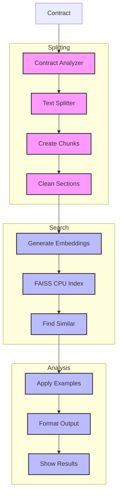

# Contract Analyzer (138)

This example demonstrates legal document analysis using LangChain's text splitters, embeddings, and example selection capabilities. The system helps legal teams analyze banking contracts for risks and requirements.

## Concepts Covered

This implementation showcases three key LangChain concepts:

1. Text Splitters
   - Document chunking
   - Content splitting
   - Recursive division
   - Smart separators

2. Embeddings
   - CPU-based search
   - Vector storage
   - FAISS indexing
   - Efficient lookup

3. Example Selection
   - Pattern matching
   - Style guidance
   - Built-in examples
   - Output structure

## System Architecture Overview



## Expected Output

Running the example produces responses like:

```
Analyzing Contract
=================
Contract: CONT-2025-001
Type: loan_agreement

Analysis Results:
================
CONTRACT ANALYSIS
---------------
Document: CONT-2025-001
Type: Loan Agreement
Section: Various

Key Findings:
1. Variable Interest Rate
   Location: Section 2.3
   Details: The interest rate is variable, based on LIBOR + 2.5%.
   Impact: Potential for increased financial burden on the borrower if interest rates rise significantly.

2. Early Repayment Penalty
   Location: Section 3.3
   Details: A 2% penalty is applied for early repayment of the loan.
   Impact: Discourages early repayment, potentially increasing total interest paid by the borrower.

3. Default Triggers
   Location: Section 6
   Details: Includes payment failure, covenant breach, material adverse change, and change of control.
   Impact: Broad definitions may lead to increased risk of default declaration by the lender.

4. Covenant Requirements
   Location: Section 5
   Details: Borrower must provide monthly financial statements, maintain asset ratios, avoid additional debt, and restrict asset sales.
   Impact: Requires strict financial management and monitoring by the borrower.

Risk Assessment:
- Risk level: High
- Risk factors: Variable interest rates, broad default triggers, strict covenants
- Risk controls: Interest rate caps, clear definitions of default events, regular financial reviews

Requirements:
1. Cap on variable interest rates to limit exposure.
2. Clear definitions and thresholds for material adverse change and change of control.
3. Regular monitoring of covenant compliance.

Next Steps:
1. Negotiate a cap on the variable interest rate to mitigate financial risk.
2. Clarify and potentially narrow the definitions of default events to reduce the risk of arbitrary default declarations.
3. Establish a process for regular financial reviews to ensure compliance with covenants.
```

## Code Breakdown

Key components include:

1. Text Splitting:
```python
from langchain.text_splitter import RecursiveCharacterTextSplitter

splitter = RecursiveCharacterTextSplitter(
    chunk_size=1000,
    chunk_overlap=100,
    separators=["\n\n", "\n", ". "]
)
chunks = splitter.split_text(text)
```

2. CPU-Based Search:
```python
from langchain_community.vectorstores import FAISS
from langchain_openai import AzureOpenAIEmbeddings

embeddings = AzureOpenAIEmbeddings(
    azure_deployment="text-embedding-3-small-3",
    model="text-embedding-3-small",
    azure_endpoint=os.getenv("AZURE_EMBEDDING_ENDPOINT")
)

# Setup FAISS with CPU support
vectorstore = FAISS.from_texts(
    texts=chunks,
    embedding=embeddings
)
```

3. Example Template:
```python
template = ChatPromptTemplate.from_messages([
    ("system", """Consider these examples:

Example 1 - Loan Agreement:
RISK ANALYSIS
-------------
- Variable rates need caps
- Penalties need review
...

Example 2 - Account Terms:
COMPLIANCE CHECK
---------------
- Privacy terms clear
- Fees disclosed
...""")
])
```

## API Reference

The example uses these LangChain components:

1. Text Splitters:
   - [RecursiveCharacterTextSplitter](https://api.python.langchain.com/en/latest/text_splitter/langchain.text_splitter.RecursiveCharacterTextSplitter.html)
   - Document processing

2. Embeddings:
   - [FAISS](https://api.python.langchain.com/en/latest/vectorstores/langchain_community.vectorstores.faiss.FAISS.html)
   - CPU-based search

3. Templates:
   - [ChatPromptTemplate](https://api.python.langchain.com/en/latest/prompts/langchain_core.prompts.chat.ChatPromptTemplate.html)
   - Pattern matching

## Dependencies

Required packages:
```
langchain>=0.1.0
langchain-openai==0.0.5
faiss-cpu>=1.7.4
python-dotenv>=1.0
```

## Best Practices

1. Text Splitting
   - Clear chunks
   - Good size
   - Smart breaks
   - Clean sections

2. Embeddings
   - CPU optimization
   - Fast indexing
   - Good similarity
   - Error handling

3. Examples
   - Clear patterns
   - Built-in format
   - Good structure
   - Clear guidance

## Common Issues

1. Setup
   - Missing keys
   - Wrong endpoint
   - Bad access
   - Model errors

2. Processing
   - Bad chunks
   - Wrong splits
   - Index errors
   - Search fails

3. Analysis
   - Wrong examples
   - Bad format
   - Poor matching
   - Style issues