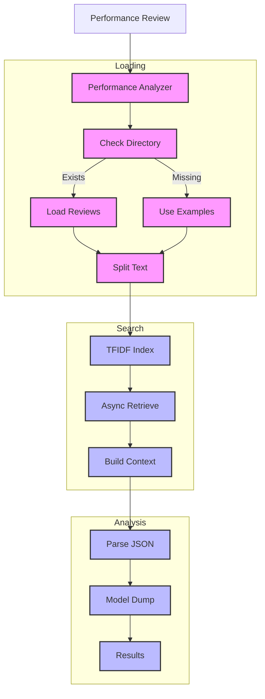

# Performance Analyzer (139)

This example demonstrates HR review analysis using LangChain's document loading, structured output, and RAG chain capabilities. The system helps HR teams analyze employee performance reviews in banking environments.

## Concepts Covered

This implementation showcases three key LangChain concepts:

1. Document Loading
   - Review ingestion
   - File processing
   - Real examples
   - Path handling

2. Structured Output
   - JSON parsing
   - Pydantic models
   - Data validation
   - Modern formatting

3. RAG Chains
   - TFIDF retrieval
   - Async operations
   - Context matching
   - Smart insights

## System Architecture Overview



## Expected Output

Running the example with actual review files produces:

```
Analyzing Performance Review
==========================
Review: REV-2025-001
Type: annual_review
Period: 2024

Historical Context (from existing reviews):
Employee Review - Q4 2024
Rating: 4.5/5.0
Performance has been consistently excellent with strong technical delivery and team leadership.
Key Strengths:
- Technical expertise in system architecture
- Effective team collaboration and mentoring

Employee Review - Q3 2024
Rating: 4.3/5.0
Strong performance with notable achievements in project management and team leadership.
Key Strengths:
- Strategic thinking and planning
- Team motivation and mentorship

Analysis Results:
================
{
  "highlights": [
    "Strong leadership of cross-functional teams",
    "98% customer satisfaction achievement",
    "Digital transformation project success",
    "25% processing time improvement"
  ],
  "concerns": [
    "Documentation detail level",
    "Peak period time management",
    "Task delegation efficiency"
  ],
  "trends": [
    {
      "pattern": "Leadership Growth",
      "details": "Consistent team leadership success",
      "impact": "High project delivery quality"
    }
  ],
  "recommendations": [
    {
      "action": "Documentation standards",
      "reason": "Knowledge transfer",
      "timeline": "Q2 2025"
    }
  ],
  "next_steps": [
    "Implement documentation process",
    "Schedule leadership training",
    "Set delegation goals"
  ]
}
```

## Code Breakdown

Key components include:

1. Review Files:
```python
# Stored in example_reviews directory
review_2024_q4.txt:
"""Employee Review - Q4 2024
Rating: 4.5/5.0
Performance has been consistently excellent...
"""

review_2024_q3.txt:
"""Employee Review - Q3 2024
Rating: 4.3/5.0
Strong performance with notable achievements...
"""
```

2. Async Retrieval:
```python
from langchain_community.retrievers import TFIDFRetriever

# Use ainvoke for async retrieval
retriever = TFIDFRetriever.from_documents(texts)
docs = await retriever.ainvoke(query)
historical = "\n\n".join(doc.page_content for doc in docs)
```

3. JSON Output:
```python
# Direct dict from JsonOutputParser
result = await chain.ainvoke({
    "review_id": review.review_id,
    "current": current,
    "historical": historical
})
print(json.dumps(result, indent=2))
```

## API Reference

The example uses these LangChain components:

1. Document Loading:
   - [DirectoryLoader](https://api.python.langchain.com/en/latest/document_loaders/langchain_community.document_loaders.directory.DirectoryLoader.html)
   - Document processing

2. Structured Output:
   - [JsonOutputParser](https://api.python.langchain.com/en/latest/output_parsers/langchain_core.output_parsers.json.JsonOutputParser.html)
   - Data formatting

3. RAG:
   - [TFIDFRetriever](https://api.python.langchain.com/en/latest/retrievers/langchain_community.retrievers.tfidf.TFIDFRetriever.html)
   - Context enhancement

## Dependencies

Required packages:
```
langchain>=0.1.0
langchain-openai==0.0.5
pydantic>=2.0
python-dotenv>=1.0
```

## Best Practices

1. Document Loading
   - Check paths
   - Real examples
   - Clean text
   - Good structure

2. Structured Output
   - Direct dict
   - Simple output
   - Good format
   - Error handling

3. RAG Chains
   - Async operations
   - Smart retrieval
   - Real context
   - Result handling

## Common Issues

1. Setup
   - Wrong paths
   - Missing files
   - Bad access
   - Model errors

2. Processing
   - JSON format
   - Dict handling
   - Retrieval fails
   - Context issues

3. Analysis
   - Poor matches
   - Bad parsing
   - Wrong format
   - Output fails