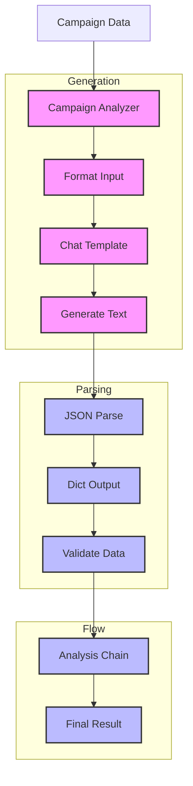

# Marketing Campaign Analysis (140)

This example demonstrates marketing campaign analysis using LangChain's text generation, structured output, and chain composition capabilities. The system helps marketing teams evaluate campaign performance with clear insights and recommendations.

## Concepts Covered

This implementation showcases three key LangChain concepts:

1. Text Generation
   - Chat models
   - Escaped JSON prompts
   - Template format
   - Consistent output

2. Structured Output
   - JSON parsing
   - Dict output
   - Data validation
   - Clean format

3. Chain Composition
   - Sequential flow
   - Data passing
   - Error handling
   - Result handling

## System Architecture Overview



## Expected Output

Running the example produces responses like:

```
Analyzing Marketing Campaign
==========================
Name: Mobile Banking App Launch
Type: mobile_launch
Segment: retail_banking
Budget: $150,000.00

Objectives:
- Drive app downloads
- Increase digital engagement
- Reduce branch transactions
- Improve customer satisfaction

Performance Metrics:
- Downloads: 25,000
- Active Users: 18,500
- Engagement Rate: 73%
- App Rating: 4.5/5.0
- Digital Transactions: +45%
- Customer Satisfaction: 92%
- Cost per Download: $6.00

Analysis Results:
================
{
  "strengths": [
    {
      "aspect": "User Adoption",
      "details": "25,000 downloads with 73% engagement",
      "impact": "Strong digital presence"
    },
    {
      "aspect": "Customer Experience",
      "details": "4.5/5.0 app rating and 92% satisfaction",
      "impact": "High user retention potential"
    }
  ],
  "weaknesses": [
    {
      "aspect": "Acquisition Cost",
      "details": "$6.00 cost per download",
      "impact": "Above industry average"
    }
  ],
  "recommendations": [
    {
      "action": "Optimize acquisition channels",
      "rationale": "Reduce cost per download",
      "timeline": "Next quarter"
    }
  ]
}
```

## Code Breakdown

Key components include:

1. Chat Setup:
```python
# Template with escaped JSON format
template = ChatPromptTemplate.from_messages([
    ("system", """You are a marketing analyst.
Output your analysis in this exact format:
{{
    "strengths": [{{
        "aspect": "Area of success",
        "details": "What went well",
        "impact": "Business effect"
    }}],
    "weaknesses": [{{
        "aspect": "Area to improve",
        "details": "What needs work",
        "impact": "Business effect"
    }}]
}}"""),
    ("human", "Analyze: {campaign_data}")
])

# Zero temperature for consistency
llm = AzureChatOpenAI(
    deployment_name=os.getenv("AZURE_OPENAI_DEPLOYMENT_NAME"),
    temperature=0
)
```

2. Output Parsing:
```python
# Parse to dict directly
parser = JsonOutputParser()  # No Pydantic model needed
result = parser.parse(response.text)  # Returns dict

# Display results
print(json.dumps(result, indent=2))  # Direct dict output
```

3. Chain Assembly:
```python
# Sequential chain returning dict
chain = (
    template    # Format with escaped JSON
    | llm      # Generate text
    | parser   # Parse to dict
)

# Run analysis
analysis = await chain.ainvoke({
    "name": campaign.name,
    "metrics": metrics_text
})

# Use dict directly
print(json.dumps(analysis, indent=2))
```

## API Reference

The example uses these LangChain components:

1. Text Generation:
   - [ChatPromptTemplate](https://api.python.langchain.com/en/latest/prompts/langchain_core.prompts.chat.ChatPromptTemplate.html)
   - Template handling

2. Structured Output:
   - [JsonOutputParser](https://api.python.langchain.com/en/latest/output_parsers/langchain_core.output_parsers.json.JsonOutputParser.html)
   - Direct dict output

3. Chain Composition:
   - [RunnablePassthrough](https://api.python.langchain.com/en/latest/runnables/langchain_core.runnables.base.RunnablePassthrough.html)
   - Sequential flow

## Dependencies

Required packages:
```
langchain>=0.1.0
langchain-openai==0.0.5
pydantic>=2.0
python-dotenv>=1.0
```

## Best Practices

1. Text Generation
   - Escaped JSON format
   - Clear instructions
   - Simple output
   - Zero temperature

2. Structured Output
   - Direct dict
   - Good validation
   - Error handling
   - Clean display

3. Chain Composition
   - Simple flow
   - Dict output
   - Error catches
   - Good logging

## Common Issues

1. Setup
   - JSON escaping
   - Template format
   - Parser type
   - Chain order

2. Processing
   - Parse errors
   - Dict access
   - Data types
   - Chain flow

3. Analysis
   - Wrong structure
   - Bad format
   - Display errors
   - Result handling